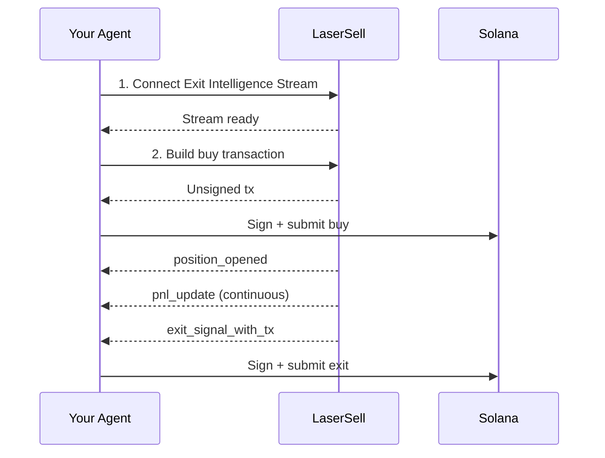

This guide walks through building an AI agent that can trade Solana tokens autonomously using LaserSell as its execution layer. The agent handles the decision-making (when to buy, what strategy to use), and LaserSell handles everything else: protocol routing, position monitoring, PnL tracking, and automated exit execution.

This pattern works regardless of how your agent is built. Whether you are extending a personal AI assistant like [OpenClaw](https://openclaw.ai/) with trading skills, building a standalone trading bot, integrating into a Telegram bot framework, or wiring up an agent built with LangChain, CrewAI, or any other framework, the LaserSell integration is the same. Your agent calls the API, connects to the stream, and signs transactions. The rest is up to you.

## What the Agent Will Do

1. **Connect** to the Exit Intelligence Stream to begin monitoring.
2. **Buy** a token by building and submitting a transaction through the REST API.
3. **Monitor** the position automatically via the stream (PnL updates, price tracking).
4. **Exit** when strategy conditions are met (target profit, stop loss, trailing stop, or deadline).

The agent does not need to know which DEX or launchpad a token is on. LaserSell resolves the protocol, builds the transaction, and delivers exit signals in real time.

## Prerequisites

- A LaserSell API key ([get one here](https://app.lasersell.io)).
- A Solana keypair (JSON byte array file).
- Python 3.10+ with the LaserSell SDK installed.

```bash
pip install lasersell-sdk[tx,stream]
```

The examples below use Python, but the same flow applies with the [TypeScript](/api/sdk/typescript), [Rust](/api/sdk/rust), or [Go](/api/sdk/go) SDKs.

## Architecture



Your agent owns the decisions. LaserSell owns the execution. The boundary between them is clean: the agent sends requests and receives events. All transactions are unsigned and signed locally by the agent.

## Step 1: Connect the Exit Intelligence Stream

The stream must be connected **before** the agent buys. The stream detects positions by watching for on-chain token arrivals in real time. If the buy lands before the stream is connected, the position will not be tracked.

```python
import asyncio
import json
import os
from pathlib import Path
from solders.keypair import Keypair
from lasersell_sdk.stream.client import StreamClient, StreamConfigure
from lasersell_sdk.stream.session import StreamSession

api_key = os.environ["LASERSELL_API_KEY"]
keypair_bytes = json.loads(Path("./keypair.json").read_text())
signer = Keypair.from_bytes(bytes(keypair_bytes))
wallet_pubkey = str(signer.pubkey())

# Connect and configure the stream
stream_client = StreamClient(api_key)
session = await StreamSession.connect(
    stream_client,
    StreamConfigure(
        wallet_pubkeys=[wallet_pubkey],
        strategy={
            "target_profit_pct": 10.0,
            "stop_loss_pct": 5.0,
            "trailing_stop_pct": 3.0,
            "sell_on_graduation": True,
        },
        deadline_timeout_sec=120,
    ),
)
```

The strategy configuration tells LaserSell when to generate exit signals:

| Parameter | Value | Meaning |
|-----------|-------|---------|
| `target_profit_pct` | `10.0` | Sell when profit reaches 10%. |
| `stop_loss_pct` | `5.0` | Sell when loss reaches 5%. |
| `trailing_stop_pct` | `3.0` | Sell when profit drops 3% from its peak. |
| `sell_on_graduation` | `true` | Sell when the token migrates from bonding curve to AMM. |
| `deadline_timeout_sec` | `120` | Force sell after 120 seconds if no other condition fires. |

Your agent can adjust these dynamically based on its own logic. See [Strategy Configuration](/api/stream/strategy-configuration).

## Step 2: Build and Submit a Buy

Once the stream is connected, the agent can buy a token. The REST API builds an unsigned transaction that the agent signs locally and submits.

```python
from lasersell_sdk.exit_api import ExitApiClient, BuildBuyTxRequest
from lasersell_sdk.tx import SendTargetHeliusSender, send_transaction, sign_unsigned_tx

api_client = ExitApiClient.with_api_key(api_key)

# Build the unsigned buy transaction
buy_request = BuildBuyTxRequest(
    mint="TOKEN_MINT_ADDRESS",
    user_pubkey=wallet_pubkey,
    amount_quote_units=100_000_000,  # 0.1 SOL in lamports
    slippage_bps=2_000,              # 20% slippage tolerance
)
response = await api_client.build_buy_tx(buy_request)

# Sign locally and submit
signed_tx = sign_unsigned_tx(response.tx, signer)
signature = await send_transaction(SendTargetHeliusSender(), signed_tx)
print(f"Buy submitted: {signature}")
```

The agent never sends its private key anywhere. LaserSell returns an unsigned transaction, the agent signs it locally, and submits it directly to the Solana network via Helius Sender.

## Step 3: Monitor and Exit Automatically

After the buy lands on-chain, the Exit Intelligence Stream detects the new token balance and begins tracking the position. The agent listens for events and acts on exit signals.

```python
from lasersell_sdk.tx import SendTargetHeliusSender, send_transaction, sign_unsigned_tx

while True:
    event = await session.recv()
    if event is None:
        break  # Stream disconnected

    if event.type == "position_opened":
        handle = event.handle
        print(f"Position opened: {handle.mint}")
        print(f"  Token account: {handle.token_account}")

    elif event.type == "pnl_update":
        msg = event.message
        pnl_pct = msg["pnl_pct"]
        print(f"PnL update: {pnl_pct:.2f}%")

    elif event.type == "exit_signal_with_tx":
        msg = event.message  # TypedDict, use dict access
        reason = msg["reason"]
        print(f"Exit signal fired: {reason}")

        # Sign and submit the pre-built exit transaction
        signed_tx = sign_unsigned_tx(str(msg["unsigned_tx_b64"]), signer)
        sig = await send_transaction(SendTargetHeliusSender(), signed_tx)
        print(f"Exit submitted: {sig}")

    elif event.type == "position_closed":
        msg = event.message
        print(f"Position closed: {msg['reason']}")
```

The key events:

| Event | What It Means |
|-------|---------------|
| `position_opened` | A new token arrived in the wallet. Tracking has started. |
| `pnl_update` | Periodic profit/loss snapshot for the position. |
| `exit_signal_with_tx` | A strategy condition was met. Contains a pre-built unsigned exit transaction ready to sign and submit. |
| `position_closed` | The position is no longer tracked (sold, transferred, or manually closed). |

## Step 4: Update Strategy Mid-Session

Your agent can adjust strategy parameters at any time based on its own logic. For example, tightening the trailing stop after a position is profitable, or disabling the deadline if the agent decides to hold longer.

```python
# Tighten trailing stop after detecting strong momentum
session.sender().update_strategy({
    "target_profit_pct": 15.0,
    "stop_loss_pct": 3.0,
    "trailing_stop_pct": 2.0,
})
```

The update takes effect immediately for all tracked positions. No reconnection needed.

## Full Working Example

Here is the complete agent loop combining all steps:

```python
import asyncio
import json
import os
from pathlib import Path
from solders.keypair import Keypair
from lasersell_sdk.exit_api import ExitApiClient, BuildBuyTxRequest
from lasersell_sdk.stream.client import StreamClient, StreamConfigure
from lasersell_sdk.stream.session import StreamSession
from lasersell_sdk.tx import SendTargetHeliusSender, send_transaction, sign_unsigned_tx


async def run_agent(mint: str, amount_lamports: int):
    api_key = os.environ["LASERSELL_API_KEY"]
    signer = Keypair.from_bytes(
        bytes(json.loads(Path("./keypair.json").read_text()))
    )
    wallet_pubkey = str(signer.pubkey())

    # --- 1. Connect the Exit Intelligence Stream ---
    stream_client = StreamClient(api_key)
    session = await StreamSession.connect(
        stream_client,
        StreamConfigure(
            wallet_pubkeys=[wallet_pubkey],
            strategy={
                "target_profit_pct": 10.0,
                "stop_loss_pct": 5.0,
                "trailing_stop_pct": 3.0,
                "sell_on_graduation": True,
            },
            deadline_timeout_sec=120,
        ),
    )

    # --- 2. Build and submit the buy ---
    api_client = ExitApiClient.with_api_key(api_key)
    buy_request = BuildBuyTxRequest(
        mint=mint,
        user_pubkey=wallet_pubkey,
        amount_quote_units=amount_lamports,
        slippage_bps=2_000,
    )
    response = await api_client.build_buy_tx(buy_request)
    signed_tx = sign_unsigned_tx(response.tx, signer)
    buy_sig = await send_transaction(SendTargetHeliusSender(), signed_tx)
    print(f"Buy submitted: {buy_sig}")

    # --- 3. Listen for events and handle exits ---
    while True:
        event = await session.recv()
        if event is None:
            print("Stream disconnected")
            break

        if event.type == "position_opened":
            print(f"Tracking position: {event.handle.mint}")

        elif event.type == "exit_signal_with_tx":
            msg = event.message
            print(f"Exit signal: {msg['reason']}")
            signed_tx = sign_unsigned_tx(str(msg["unsigned_tx_b64"]), signer)
            sig = await send_transaction(SendTargetHeliusSender(), signed_tx)
            print(f"Exit submitted: {sig}")
            break  # Position exited, agent is done

        elif event.type == "position_closed":
            print(f"Position closed: {event.message['reason']}")
            break


asyncio.run(run_agent(
    mint="TOKEN_MINT_ADDRESS",
    amount_lamports=100_000_000,  # 0.1 SOL
))
```

## Extending This Pattern

This guide shows a single buy-and-exit cycle. A production agent would build on this foundation:

**Signal integration.** The agent receives buy signals from any source: user prompts, on-chain analysis, social feeds, copy-trading leaders, or another AI model. The signal determines when to call `build_buy_tx`.

**Multi-position management.** The stream tracks multiple positions simultaneously across one or more wallets. An agent can manage a portfolio of active positions, each with its own entry logic, while LaserSell evaluates exit conditions on all of them in parallel.

**Dynamic strategy.** Use `update_strategy` to adjust parameters based on market conditions, position performance, or agent confidence. An agent that detects high volatility might tighten stops. One that detects a strong trend might widen them.

**Risk controls.** Enforce position sizing, maximum concurrent positions, daily loss limits, or any other risk rules in your agent's decision layer before calling the API.

**MCP integration.** If your agent runs inside an MCP-compatible client like [OpenClaw](https://openclaw.ai/), Claude, Cursor, or another AI assistant, it can use the [LaserSell MCP server](/ai-agents/mcp-server) to look up documentation, API schemas, and code examples in real time while building or debugging the integration.

## Next Steps

- [API Overview](/api/overview) for the full API surface.
- [Exit Intelligence Stream](/api/stream/overview) for the stream protocol deep dive.
- [Strategy Configuration](/api/stream/strategy-configuration) for all strategy parameters.
- [Transaction Signing](/api/transactions/signing) for signing and submission details.
- [MCP Server](/ai-agents/mcp-server) to give your AI agent access to LaserSell documentation.
