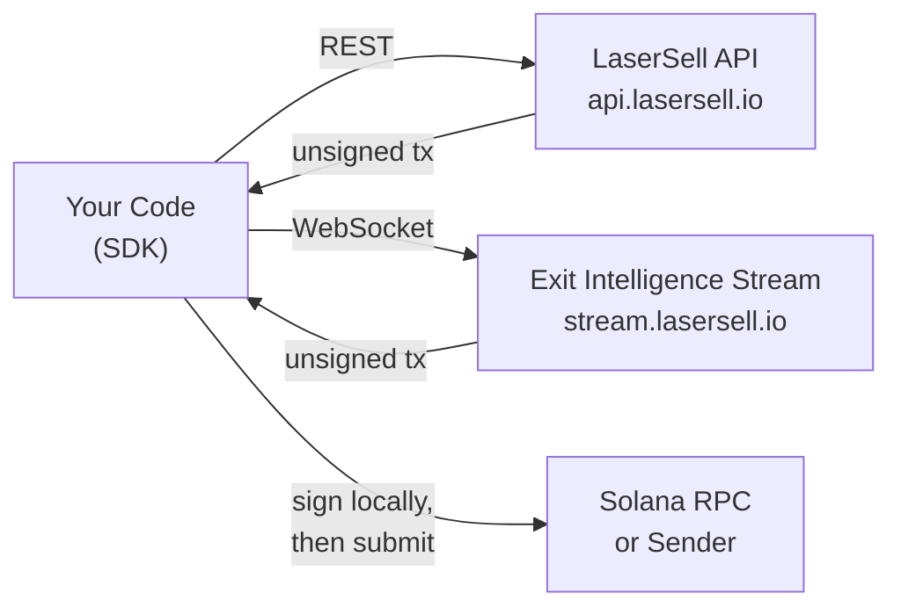

## What is the LaserSell API?

The LaserSell API lets you build, sign, and submit Solana swap transactions programmatically. It exposes two surfaces:

- **LaserSell API** (REST) — Build unsigned buy and sell transactions on demand via `POST /v1/sell` and `POST /v1/buy`.
- **Exit Intelligence Stream** (WebSocket) — Connect a persistent session that watches your wallets, tracks positions, evaluates your strategy in real time, and delivers pre built exit transactions when thresholds are met.

Both surfaces return **unsigned transactions**. Your private key never leaves your machine. You sign locally, then submit through the send target of your choice.

## Non Custodial Model

LaserSell is fully non custodial. The server constructs optimized swap instructions but cannot execute them without your signature. This means:

1. You hold the keypair at all times.
2. The API returns a base64 encoded unsigned transaction.
3. You sign with your local keypair.
4. You submit via RPC, Helius Sender, or Astralane.

No funds, tokens, or keys are ever stored or accessed by LaserSell infrastructure.

## Architecture at a Glance

## SDK Languages

Official SDKs are available in four languages, each providing the same capabilities:

| Language   | Package                          | Modules                                        |
|------------|----------------------------------|-------------------------------------------------|
| TypeScript | `@lasersell/lasersell-sdk`       | `ExitApiClient`, `StreamClient`, `StreamSession`, tx helpers |
| Python     | `lasersell-sdk`                  | `ExitApiClient`, `StreamClient`, `StreamSession`, tx helpers |
| Rust       | `lasersell-sdk`                  | `exit_api`, `stream`, `tx`                      |
| Go         | `github.com/lasersell/lasersell-sdk/go` | `ExitAPIClient`, `stream.StreamClient`, `stream.Session`, tx helpers |

All SDKs share the same request and response schemas, error types, and retry behavior. Pick the language that fits your stack and follow the corresponding SDK guide.

## What to Read Next

- [Authentication](/api/authentication) — Get your API key and start making requests.
- [Quickstart](/api/quickstart) — Build your first sell transaction in under five minutes.
- [Exit Intelligence Stream](/api/stream/overview) — Learn when to use the WebSocket stream instead of REST.
