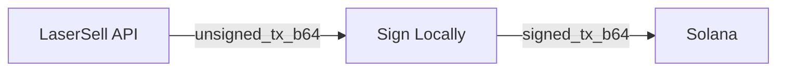

## Non Custodial Flow

LaserSell never touches your private key. Every transaction follows this pattern:

1. **Build**: The API returns a base64 encoded unsigned `VersionedTransaction`.
2. **Sign**: You decode, sign, and re encode locally using your keypair.
3. **Submit**: You send the signed transaction to the Solana network via a [send target](/api/transactions/send-targets).



## Loading a Keypair

All SDKs expect a Solana keypair. The standard format is a JSON file containing an array of 64 bytes (as used by `solana-keygen`).

<CodeGroup>
```typescript TypeScript
import { readFile } from "node:fs/promises";
import { Keypair } from "@solana/web3.js";

const raw = await readFile("./keypair.json", "utf8");
const keypair = Keypair.fromSecretKey(
  Uint8Array.from(JSON.parse(raw))
);
```

```python Python
import json
from pathlib import Path
from solders.keypair import Keypair

raw = json.loads(Path("./keypair.json").read_text())
keypair = Keypair.from_bytes(bytes(raw))
```

```rust Rust
use solana_sdk::signature::read_keypair_file;

let keypair = read_keypair_file("./keypair.json")?;
```

```go Go
import "github.com/gagliardetto/solana-go"

privateKey, err := solana.PrivateKeyFromSolanaKeygenFile("./keypair.json")
```
</CodeGroup>

## Signing Functions

### Standard Sign

Decodes the unsigned transaction, signs it with your keypair, and returns a signed `VersionedTransaction` object.

<CodeGroup>
```typescript TypeScript
import { signUnsignedTx } from "@lasersell/lasersell-sdk";

const signedTx = signUnsignedTx(unsignedTxB64, keypair);
```

```python Python
from lasersell_sdk.tx import sign_unsigned_tx

signed_tx = sign_unsigned_tx(unsigned_tx_b64, keypair)
```

```rust Rust
use lasersell_sdk::tx::sign_unsigned_tx;

let signed_tx = sign_unsigned_tx(&unsigned_tx_b64, &keypair)?;
```

```go Go
import lasersell "github.com/lasersell/lasersell-sdk/go"

signedTx, err := lasersell.SignUnsignedTx(unsignedTxB64, privateKey)
```
</CodeGroup>

### Fast Sign (TypeScript)

The TypeScript SDK provides `signUnsignedTxB64Fast`, which signs the raw bytes in place without deserializing through `VersionedTransaction`. This avoids allocation on the hot path and returns the signed transaction as a base64 string directly.

```typescript
import { signUnsignedTxB64Fast } from "@lasersell/lasersell-sdk";

const signedTxB64 = signUnsignedTxB64Fast(unsignedTxB64, keypair);
```

### Sign and Send (One Step)

Combines signing and submission into a single call.

<CodeGroup>
```typescript TypeScript
import { signAndSendUnsignedTxB64, sendTargetHeliusSender } from "@lasersell/lasersell-sdk";

const signature = await signAndSendUnsignedTxB64(
  sendTargetHeliusSender(),
  unsignedTxB64,
  keypair,
);
```
</CodeGroup>

## Submitting the Signed Transaction

After signing, submit to the Solana network using a send target:

<CodeGroup>
```typescript TypeScript
import { sendTransaction, sendTargetHeliusSender } from "@lasersell/lasersell-sdk";

const signature = await sendTransaction(sendTargetHeliusSender(), signedTx);
```

```python Python
from lasersell_sdk.tx import send_transaction, SendTargetHeliusSender

signature = await send_transaction(SendTargetHeliusSender(), signed_tx)
```

```rust Rust
use lasersell_sdk::tx::{SendTarget, send_transaction};

let http = reqwest::Client::new();
let signature = send_transaction(&http, &SendTarget::HeliusSender, &signed_tx).await?;
```

```go Go
import lasersell "github.com/lasersell/lasersell-sdk/go"

sig, err := lasersell.SendTransaction(ctx, nil, lasersell.SendTargetHeliusSender(), signedTx)
```
</CodeGroup>

## Error Types

Signing and submission errors are surfaced through `TxSubmitError`:

| Kind                      | Description                                         |
|---------------------------|-----------------------------------------------------|
| `decode_unsigned_tx`      | Base64 decoding of the unsigned transaction failed. |
| `deserialize_unsigned_tx` | Transaction bytes could not be deserialized.        |
| `sign_tx`                 | Signing failed (wrong keypair, corrupted data).     |
| `serialize_tx`            | Serialization of the signed transaction failed.     |
| `request_send`            | Network error during submission.                    |
| `response_read`           | Could not read the RPC response body.               |
| `http_status`             | Non 2xx HTTP response from the RPC endpoint.        |
| `decode_response`         | Response body was not valid JSON.                   |
| `rpc_error`               | RPC returned an error object.                       |
| `missing_result`          | Response did not contain a transaction signature.   |

## Security Best Practices

- **Never log or transmit** your private key.
- **Load keys from environment variables** or encrypted files in production.
- **Verify the wallet address** matches the `user_pubkey` used in the build request. The API constructs the transaction for that specific signer.
