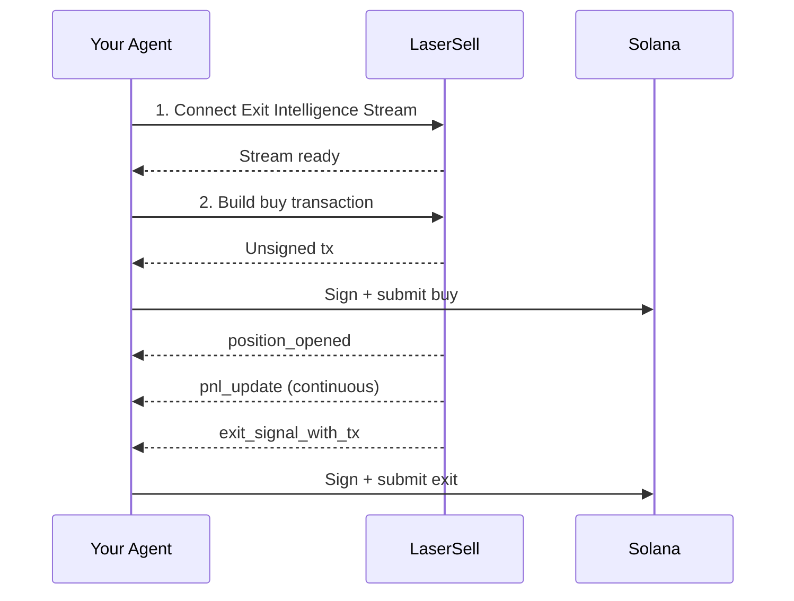

يرشدك هذا الدليل خلال بناء وكيل ذكاء اصطناعي يمكنه تداول رموز Solana بشكل مستقل باستخدام LaserSell كطبقة التنفيذ. يتعامل الوكيل مع اتخاذ القرارات (متى يشتري وأي استراتيجية يستخدم) ويتعامل LaserSell مع كل شيء آخر: توجيه البروتوكول ومراقبة المراكز وتتبع الأرباح والخسائر وتنفيذ الخروج الآلي.

يعمل هذا النمط بغض النظر عن كيفية بناء وكيلك. سواء كنت توسع مساعداً شخصياً بالذكاء الاصطناعي مثل [OpenClaw](https://openclaw.ai/) بمهارات تداول أو تبني روبوت تداول مستقل أو تدمج في إطار روبوت Telegram أو تربط وكيلاً مبنياً بـ LangChain أو CrewAI أو أي إطار آخر، تكامل LaserSell هو نفسه. يستدعي وكيلك الواجهة البرمجية ويتصل بالبث ويوقع المعاملات. الباقي يعود إليك.

## ما سيفعله الوكيل

1. **الاتصال** ببث ذكاء الخروج لبدء المراقبة.
2. **الشراء** عن طريق بناء وتقديم معاملة عبر واجهة REST البرمجية.
3. **المراقبة** التلقائية للمركز عبر البث (تحديثات الأرباح والخسائر وتتبع الأسعار).
4. **الخروج** عند استيفاء شروط الاستراتيجية (جني الأرباح أو وقف الخسارة أو الوقف المتحرك أو الموعد النهائي).

لا يحتاج الوكيل لمعرفة التبادل اللامركزي أو منصة الإطلاق التي يعمل عليها الرمز. يحل LaserSell البروتوكول ويبني المعاملة ويسلّم إشارات الخروج في الوقت الفعلي.

## المتطلبات

- مفتاح LaserSell API ([احصل على واحد هنا](https://app.lasersell.io)).
- زوج مفاتيح Solana (ملف مصفوفة بايتات JSON).
- Python 3.10+ مع تثبيت حزمة تطوير LaserSell.

```bash
pip install lasersell-sdk[tx,stream]
```

الأمثلة أدناه تستخدم Python لكن نفس التدفق ينطبق مع حزم تطوير [TypeScript](/api/sdk/typescript) أو [Rust](/api/sdk/rust) أو [Go](/api/sdk/go).

## البنية



وكيلك يملك القرارات. LaserSell يملك التنفيذ. الحدود بينهما واضحة: يرسل الوكيل طلبات ويتلقى أحداثاً. جميع المعاملات غير موقعة وتُوقّع محلياً من قبل الوكيل.

## الخطوة 1: الاتصال ببث ذكاء الخروج

يجب توصيل البث **قبل** أن يشتري الوكيل. يكتشف البث المراكز من خلال مراقبة وصول الرموز على السلسلة في الوقت الفعلي. إذا هبطت عملية الشراء قبل توصيل البث، لن يتم تتبع المركز.

```python
import asyncio
import json
import os
from pathlib import Path
from solders.keypair import Keypair
from lasersell_sdk.stream.client import StreamClient, StreamConfigure
from lasersell_sdk.stream.session import StreamSession

api_key = os.environ["LASERSELL_API_KEY"]
keypair_bytes = json.loads(Path("./keypair.json").read_text())
signer = Keypair.from_bytes(bytes(keypair_bytes))
wallet_pubkey = str(signer.pubkey())

# Connect and configure the stream
stream_client = StreamClient(api_key)
session = await StreamSession.connect(
    stream_client,
    StreamConfigure(
        wallet_pubkeys=[wallet_pubkey],
        strategy={
            "target_profit_pct": 10.0,
            "stop_loss_pct": 5.0,
            "trailing_stop_pct": 3.0,
            "sell_on_graduation": True,
        },
        deadline_timeout_sec=120,
        send_mode="helius_sender",
        tip_lamports=1000,
    ),
)
```

يخبر تكوين الاستراتيجية LaserSell متى يولّد إشارات الخروج:

| المعامل | القيمة | المعنى |
|-----------|-------|---------|
| `target_profit_pct` | `10.0` | بيع عندما يصل الربح إلى 10%. |
| `stop_loss_pct` | `5.0` | بيع عندما تصل الخسارة إلى 5%. |
| `trailing_stop_pct` | `3.0` | بيع عندما ينخفض الربح 3% من ذروته. |
| `sell_on_graduation` | `true` | بيع عندما ينتقل الرمز من منحنى الربط إلى AMM. |
| `deadline_timeout_sec` | `120` | بيع إجباري بعد 120 ثانية إذا لم ينطلق أي شرط آخر. |

يمكن لوكيلك تعديل هذه ديناميكياً بناءً على منطقه الخاص. راجع [تكوين الاستراتيجية](/api/stream/strategy-configuration).

## الخطوة 2: بناء وتقديم عملية شراء

بمجرد توصيل البث، يمكن للوكيل شراء رمز. تبني واجهة REST البرمجية معاملة غير موقعة يوقعها الوكيل محلياً ويقدمها.

```python
from lasersell_sdk.exit_api import ExitApiClient, BuildBuyTxRequest
from lasersell_sdk.tx import SendTargetHeliusSender, send_transaction, sign_unsigned_tx

api_client = ExitApiClient.with_api_key(api_key)

# Build the unsigned buy transaction
buy_request = BuildBuyTxRequest(
    mint="TOKEN_MINT_ADDRESS",
    user_pubkey=wallet_pubkey,
    amount=0.1,  # 0.1 SOL
    slippage_bps=2_000,              # 20% slippage tolerance
)
response = await api_client.build_buy_tx(buy_request)

# Sign locally and submit
signed_tx = sign_unsigned_tx(response.tx, signer)
signature = await send_transaction(SendTargetHeliusSender(), signed_tx)
print(f"Buy submitted: {signature}")
```

لا يرسل الوكيل مفتاحه الخاص إلى أي مكان أبداً. يُعيد LaserSell معاملة غير موقعة ويوقعها الوكيل محلياً ويقدمها مباشرة إلى شبكة Solana عبر Helius Sender.

## الخطوة 3: المراقبة والخروج تلقائياً

بعد هبوط عملية الشراء على السلسلة، يكتشف بث ذكاء الخروج رصيد الرمز الجديد ويبدأ تتبع المركز. يستمع الوكيل للأحداث ويتصرف عند إشارات الخروج.

```python
from lasersell_sdk.tx import SendTargetHeliusSender, send_transaction, sign_unsigned_tx

while True:
    event = await session.recv()
    if event is None:
        break  # Stream disconnected

    if event.type == "position_opened":
        handle = event.handle
        print(f"Position opened: {handle.mint}")
        print(f"  Token account: {handle.token_account}")

    elif event.type == "pnl_update":
        msg = event.message
        pnl_pct = msg["pnl_pct"]
        print(f"PnL update: {pnl_pct:.2f}%")

    elif event.type == "exit_signal_with_tx":
        msg = event.message  # TypedDict, use dict access
        reason = msg["reason"]
        print(f"Exit signal fired: {reason}")

        # Sign and submit the pre-built exit transaction
        signed_tx = sign_unsigned_tx(str(msg["unsigned_tx_b64"]), signer)
        sig = await send_transaction(SendTargetHeliusSender(), signed_tx)
        print(f"Exit submitted: {sig}")

    elif event.type == "position_closed":
        msg = event.message
        print(f"Position closed: {msg['reason']}")
```

الأحداث الرئيسية:

| الحدث | ما يعنيه |
|-------|---------------|
| `position_opened` | وصل رمز جديد إلى المحفظة. بدأ التتبع. |
| `pnl_update` | لقطة دورية للربح/الخسارة للمركز. |
| `exit_signal_with_tx` | تم استيفاء شرط استراتيجية. يحتوي على معاملة خروج غير موقعة مبنية مسبقاً جاهزة للتوقيع والتقديم. |
| `position_closed` | لم يعد المركز متتبعاً (تم البيع أو النقل أو الإغلاق يدوياً). |

## الخطوة 4: تحديث الاستراتيجية أثناء الجلسة

يمكن لوكيلك تعديل معاملات الاستراتيجية في أي وقت بناءً على منطقه الخاص. على سبيل المثال، تشديد الوقف المتحرك بعد أن يصبح المركز مربحاً أو تعطيل الموعد النهائي إذا قرر الوكيل الاحتفاظ لفترة أطول.

```python
# Tighten trailing stop after detecting strong momentum
session.sender().update_strategy({
    "target_profit_pct": 15.0,
    "stop_loss_pct": 3.0,
    "trailing_stop_pct": 2.0,
})
```

يسري التحديث فوراً لجميع المراكز المتتبعة. لا حاجة لإعادة الاتصال.

## مثال عملي كامل

إليك حلقة الوكيل الكاملة التي تجمع جميع الخطوات:

```python
import asyncio
import json
import os
from pathlib import Path
from solders.keypair import Keypair
from lasersell_sdk.exit_api import ExitApiClient, BuildBuyTxRequest
from lasersell_sdk.stream.client import StreamClient, StreamConfigure
from lasersell_sdk.stream.session import StreamSession
from lasersell_sdk.tx import SendTargetHeliusSender, send_transaction, sign_unsigned_tx


async def run_agent(mint: str, amount_sol: float):
    api_key = os.environ["LASERSELL_API_KEY"]
    signer = Keypair.from_bytes(
        bytes(json.loads(Path("./keypair.json").read_text()))
    )
    wallet_pubkey = str(signer.pubkey())

    # --- 1. Connect the Exit Intelligence Stream ---
    stream_client = StreamClient(api_key)
    session = await StreamSession.connect(
        stream_client,
        StreamConfigure(
            wallet_pubkeys=[wallet_pubkey],
            strategy={
                "target_profit_pct": 10.0,
                "stop_loss_pct": 5.0,
                "trailing_stop_pct": 3.0,
                "sell_on_graduation": True,
            },
            deadline_timeout_sec=120,
        ),
    )

    # --- 2. Build and submit the buy ---
    api_client = ExitApiClient.with_api_key(api_key)
    buy_request = BuildBuyTxRequest(
        mint=mint,
        user_pubkey=wallet_pubkey,
        amount=amount_sol,
        slippage_bps=2_000,
    )
    response = await api_client.build_buy_tx(buy_request)
    signed_tx = sign_unsigned_tx(response.tx, signer)
    buy_sig = await send_transaction(SendTargetHeliusSender(), signed_tx)
    print(f"Buy submitted: {buy_sig}")

    # --- 3. Listen for events and handle exits ---
    while True:
        event = await session.recv()
        if event is None:
            print("Stream disconnected")
            break

        if event.type == "position_opened":
            print(f"Tracking position: {event.handle.mint}")

        elif event.type == "exit_signal_with_tx":
            msg = event.message
            print(f"Exit signal: {msg['reason']}")
            signed_tx = sign_unsigned_tx(str(msg["unsigned_tx_b64"]), signer)
            sig = await send_transaction(SendTargetHeliusSender(), signed_tx)
            print(f"Exit submitted: {sig}")
            break  # Position exited, agent is done

        elif event.type == "position_closed":
            print(f"Position closed: {event.message['reason']}")
            break


asyncio.run(run_agent(
    mint="TOKEN_MINT_ADDRESS",
    amount_sol=0.1,  # 0.1 SOL
))
```

## توسيع هذا النمط

يعرض هذا الدليل دورة شراء وخروج واحدة. وكيل الإنتاج سيبني على هذا الأساس:

**تكامل الإشارات.** يتلقى الوكيل إشارات شراء من أي مصدر: مطالبات المستخدم أو تحليل على السلسلة أو موجزات اجتماعية أو قادة نسخ التداول أو نموذج ذكاء اصطناعي آخر. تحدد الإشارة متى يستدعي `build_buy_tx`.

**إدارة مراكز متعددة.** يتتبع البث مراكز متعددة في وقت واحد عبر محفظة أو أكثر. يمكن للوكيل إدارة محفظة من المراكز النشطة لكل منها منطق دخول خاص بينما يقيّم LaserSell شروط الخروج عليها جميعاً بالتوازي.

**استراتيجية ديناميكية.** استخدم `update_strategy` لضبط المعاملات بناءً على ظروف السوق أو أداء المركز أو ثقة الوكيل. وكيل يكتشف تقلباً عالياً قد يشدد الأوقاف. وكيل يكتشف اتجاهاً قوياً قد يوسعها.

**ضوابط المخاطر.** فرض أحجام المراكز والحد الأقصى للمراكز المتزامنة وحدود الخسارة اليومية أو أي قواعد مخاطر أخرى في طبقة قرار وكيلك قبل استدعاء الواجهة البرمجية.

**تكامل MCP.** إذا كان وكيلك يعمل داخل عميل متوافق مع MCP مثل [OpenClaw](https://openclaw.ai/) أو Claude أو Cursor أو مساعد ذكاء اصطناعي آخر، يمكنه استخدام [خادم LaserSell MCP](/ai-agents/mcp-server) للبحث عن الوثائق ومخططات الواجهة البرمجية وأمثلة الكود في الوقت الفعلي أثناء بناء أو تصحيح التكامل.

## الخطوات التالية

- [نظرة عامة على الواجهة البرمجية](/api/overview) للسطح الكامل للواجهة البرمجية.
- [بث ذكاء الخروج](/api/stream/overview) للغوص العميق في بروتوكول البث.
- [تكوين الاستراتيجية](/api/stream/strategy-configuration) لجميع معاملات الاستراتيجية.
- [توقيع المعاملات](/api/transactions/signing) لتفاصيل التوقيع والتقديم.
- [خادم MCP](/ai-agents/mcp-server) لمنح وكيل الذكاء الاصطناعي الوصول إلى وثائق LaserSell.
