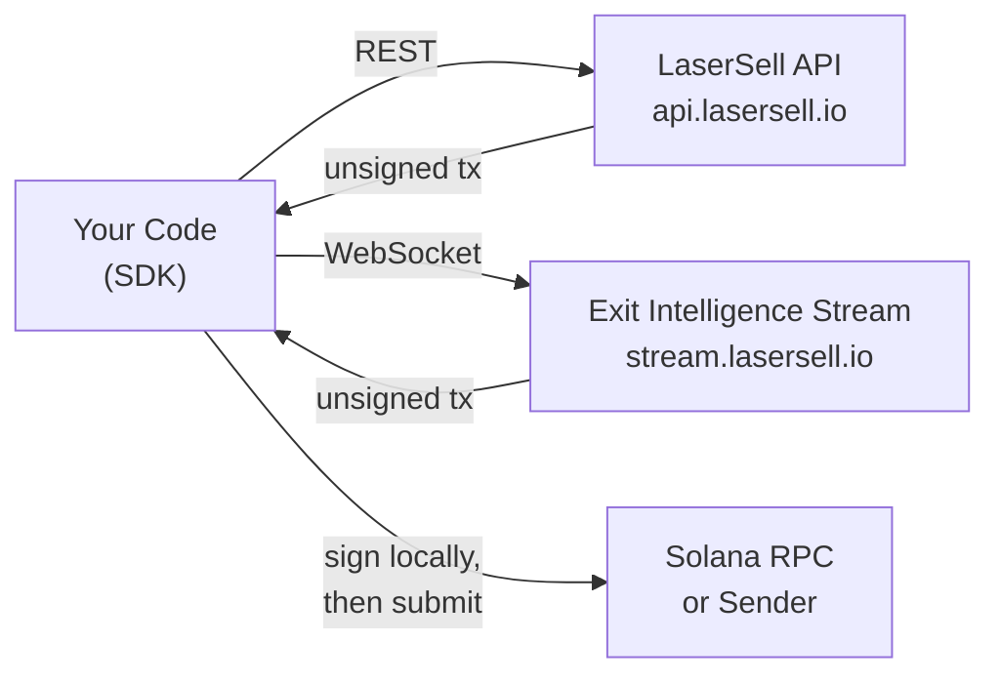

## ما هي LaserSell API؟

تتيح لك LaserSell API بناء وتوقيع وتقديم معاملات مبادلة Solana برمجياً. تكشف عن سطحين:

- **LaserSell API** (REST): بناء معاملات شراء وبيع غير موقعة حسب الطلب عبر `POST /v1/sell` و`POST /v1/buy`. استرجاع تفاصيل حسابك عبر `GET /v1/account` والاستعلام عن سجل تداولك عبر `GET /v1/history`.
- **بث ذكاء الخروج** (WebSocket): اتصال جلسة مستمرة تراقب محافظك وتتتبع المراكز وتقيّم استراتيجيتك في الوقت الفعلي وتسلّم معاملات خروج مبنية مسبقاً عند استيفاء العتبات.

يُعيد كلا السطحين **معاملات غير موقعة**. مفتاحك الخاص لا يغادر جهازك أبداً. توقّع محلياً ثم تقدم عبر هدف الإرسال الذي تختاره.

## النموذج غير الوصائي

LaserSell غير وصائي بالكامل. يبني الخادم تعليمات مبادلة محسّنة لكن لا يستطيع تنفيذها بدون توقيعك. هذا يعني:

1. تمتلك زوج المفاتيح في جميع الأوقات.
2. تُعيد الواجهة البرمجية معاملة غير موقعة مشفرة بـ base64.
3. توقّع بزوج المفاتيح المحلي.
4. تقدم عبر RPC أو Helius Sender أو Astralane.

لا أموال أو رموز أو مفاتيح تُخزّن أو يُوصل إليها بواسطة بنية LaserSell التحتية أبداً.

## البنية باختصار

## لغات حزمة التطوير

حزم تطوير رسمية متوفرة بأربع لغات، كل منها يوفر نفس القدرات:

| اللغة | الحزمة | الوحدات |
|------------|----------------------------------|-------------------------------------------------|
| TypeScript | `@lasersell/lasersell-sdk` | `ExitApiClient`, `StreamClient`, `StreamSession`, tx helpers |
| Python | `lasersell-sdk` | `ExitApiClient`, `StreamClient`, `StreamSession`, tx helpers |
| Rust | `lasersell-sdk` | `exit_api`, `stream`, `tx` |
| Go | `github.com/lasersell/lasersell-sdk/go` | `ExitAPIClient`, `stream.StreamClient`, `stream.StreamSession`, tx helpers |

تشترك جميع حزم التطوير في نفس مخططات الطلب والاستجابة وأنواع الأخطاء وسلوك إعادة المحاولة. اختر اللغة التي تناسب مجموعتك التقنية واتبع دليل حزمة التطوير المقابل.

## ما يجب قراءته بعد ذلك

- [المصادقة](/api/authentication): احصل على مفتاح API وابدأ في إرسال الطلبات.
- [البدء السريع](/api/quickstart): ابنِ أول معاملة بيع في أقل من خمس دقائق.
- [بث ذكاء الخروج](/api/stream/overview): تعرف متى تستخدم بث WebSocket بدلاً من REST.
