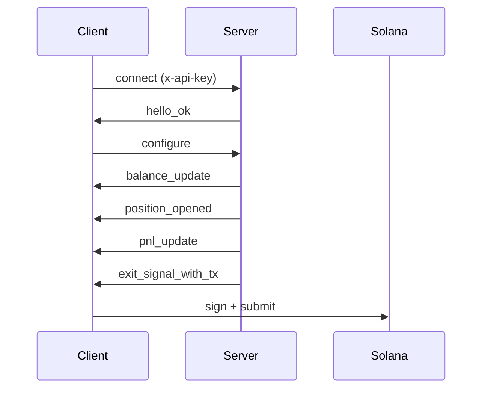

راجع [النسخة الإنجليزية](/api/stream/overview) للوثائق التقنية الكاملة مع أمثلة الكود. هذه الصفحة تغطي المفاهيم الأساسية.

## ما هو بث ذكاء الخروج؟

بث ذكاء الخروج هو اتصال WebSocket مستمر يراقب محافظك على السلسلة ويتتبع مراكز الرموز ويقيّم استراتيجية الأرباح والخسائر في الوقت الفعلي ويسلّم معاملات خروج غير موقعة مبنية مسبقاً عند استيفاء عتباتك.

مشتركو مستوى **Professional وAdvanced** يتلقون أيضاً [لقطات سيولة](/api/stream/server-events#liquidity_snapshot) في الوقت الفعلي مع نطاقات انزلاق وبيانات اتجاه السيولة.

## نقطة النهاية

```
wss://stream.lasersell.io/v1/ws
```

تتم المصادقة عبر ترويسة `x-api-key` التي تضبطها حزم التطوير تلقائياً.

## متى تستخدم بث ذكاء الخروج مقابل REST

| السيناريو                                     | الاستخدام                          |
|----------------------------------------------|------------------------------|
| بيع آلي عند الوصول لهدف الربح/الخسارة | بث ذكاء الخروج     |
| معاملة شراء أو بيع واحدة               | REST (LaserSell API)         |
| مراقبة مراكز مستمرة                | بث ذكاء الخروج     |
| بناء معاملة لتأكيد المستخدم  | REST (LaserSell API)         |
| روبوت يتفاعل مع نشاط المحفظة            | بث ذكاء الخروج     |

استخدم **بث ذكاء الخروج** عندما تريد من الخادم مراقبة مراكزك وتسليم معاملات الخروج تلقائياً. استخدم **واجهة REST البرمجية** عندما تحتاج معاملة واحدة مبنية حسب الطلب.

<Warning>
**اتصل بالبث قبل الشراء.** يكتشف بث ذكاء الخروج المراكز الجديدة من خلال مراقبة وصول الرموز على السلسلة. إذا استدعيت `/v1/buy` قبل توصيل البث وتكوينه، لن يتم تتبع المركز الناتج ولن تنطلق إشارات الخروج. اتصل دائماً بالبث وهيئه أولاً ثم قدم عملية الشراء.
</Warning>

## التدفق عالي المستوى

1. **اتصل** بـ `wss://stream.lasersell.io/v1/ws` بمفتاح API.
2. استقبل `hello_ok` من الخادم (يتضمن معرف الجلسة وحدود المعدل).
3. **أرسل `configure`** بالمفاتيح العامة للمحافظ ومعاملات استراتيجيتك.
4. استقبل رسائل `balance_update` الأولية لحيازات الرموز الموجودة.
5. **يراقب البث** محافظك بحثاً عن وصول رموز جديدة ويتتبع الأرباح والخسائر.
6. عندما يصل مركز إلى جني الأرباح أو وقف الخسارة أو الوقف المتحرك أو الموعد النهائي، يرسل الخادم `exit_signal_with_tx`.
7. **وقّع محلياً** وقدم المعاملة غير الموقعة.



## نقاط دخول حزمة التطوير

توفر حزم التطوير مستويين من التجريد:

- **`StreamClient`**: عميل منخفض المستوى. يدير اتصال WebSocket وإعادة الاتصال وتأطير الرسائل. يُعيد كائنات `ServerMessage` خام.
- **`StreamSession`**: غلاف عالي المستوى. يغلف `StreamClient` بتتبع المراكز ومؤقتات الموعد النهائي وتخزين لقطات السيولة المؤقت وكائنات `StreamEvent` المصنفة التي تتضمن `PositionHandle`.

لمعظم حالات الاستخدام، ابدأ بـ `StreamSession`.

راجع [النسخة الإنجليزية](/api/stream/overview) لأمثلة الكود الكاملة بأربع لغات.

## الخطوات التالية

- [دورة حياة الاتصال](/api/stream/connection-lifecycle): المصافحة التفصيلية وإعادة الاتصال وفصل المسارات.
- [تكوين الاستراتيجية](/api/stream/strategy-configuration): تكوين أهداف الأرباح وأوقاف الخسارة والوقف المتحرك.
- [أحداث الخادم](/api/stream/server-events): المخطط الكامل لجميع أنواع رسائل الخادم التسعة بما في ذلك لقطات السيولة.
- [رسائل العميل](/api/stream/client-messages): جميع أنواع رسائل العميل الستة ومخططاتها.
