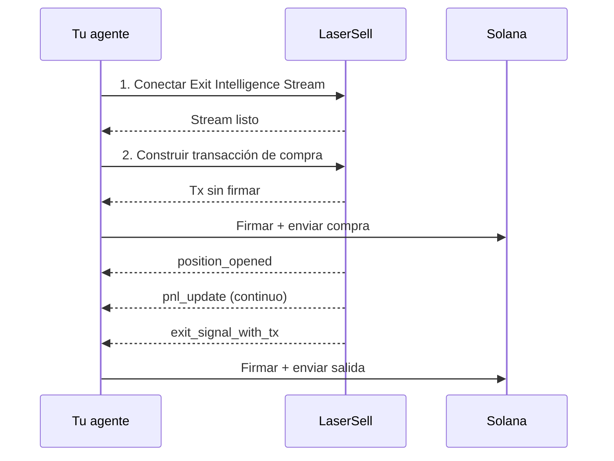

Esta guía te lleva a través de la construcción de un agente de IA que puede operar tokens de Solana de forma autónoma usando LaserSell como su capa de ejecución. El agente maneja la toma de decisiones (cuándo comprar, qué estrategia usar), y LaserSell maneja todo lo demás: enrutamiento de protocolo, monitoreo de posiciones, seguimiento de PnL y ejecución automatizada de salidas.

Este patrón funciona independientemente de cómo esté construido tu agente. Ya sea que estés extendiendo un asistente de IA personal como [OpenClaw](https://openclaw.ai/) con habilidades de trading, construyendo un bot de trading independiente, integrando en un framework de bot de Telegram, o conectando un agente construido con LangChain, CrewAI o cualquier otro framework, la integración de LaserSell es la misma. Tu agente llama a la API, se conecta al stream y firma transacciones. El resto depende de ti.

## Qué hará el agente

1. **Conectarse** al Exit Intelligence Stream para comenzar el monitoreo.
2. **Comprar** un token construyendo y enviando una transacción a través de la API REST.
3. **Monitorear** la posición automáticamente a través del stream (actualizaciones de PnL, seguimiento de precios).
4. **Salir** cuando se cumplan las condiciones de estrategia (take profit, stop loss, trailing stop o deadline).

El agente no necesita saber en qué DEX o launchpad está un token. LaserSell resuelve el protocolo, construye la transacción y entrega señales de salida en tiempo real.

## Prerrequisitos

- Una clave API de LaserSell ([obtén una aquí](https://app.lasersell.io)).
- Un par de claves de Solana (archivo de array de bytes JSON).
- Python 3.10+ con el SDK de LaserSell instalado.

```bash
pip install lasersell-sdk[tx,stream]
```

Los ejemplos a continuación usan Python, pero el mismo flujo aplica con los SDKs de [TypeScript](/api/sdk/typescript), [Rust](/api/sdk/rust) o [Go](/api/sdk/go).

## Arquitectura



Tu agente toma las decisiones. LaserSell se encarga de la ejecución. El límite entre ellos es claro: el agente envía solicitudes y recibe eventos. Todas las transacciones están sin firmar y se firman localmente por el agente.

## Paso 1: Conectar el Exit Intelligence Stream

El stream debe estar conectado **antes** de que el agente compre. El stream detecta posiciones observando las llegadas de tokens en cadena en tiempo real. Si la compra aterriza antes de que el stream esté conectado, la posición no será rastreada.

```python
import asyncio
import json
import os
from pathlib import Path
from solders.keypair import Keypair
from lasersell_sdk.stream.client import StreamClient, StreamConfigure
from lasersell_sdk.stream.session import StreamSession

api_key = os.environ["LASERSELL_API_KEY"]
keypair_bytes = json.loads(Path("./keypair.json").read_text())
signer = Keypair.from_bytes(bytes(keypair_bytes))
wallet_pubkey = str(signer.pubkey())

# Connect and configure the stream
stream_client = StreamClient(api_key)
session = await StreamSession.connect(
    stream_client,
    StreamConfigure(
        wallet_pubkeys=[wallet_pubkey],
        strategy={
            "target_profit_pct": 10.0,
            "stop_loss_pct": 5.0,
            "trailing_stop_pct": 3.0,
            "sell_on_graduation": True,
        },
        deadline_timeout_sec=120,
        send_mode="helius_sender",
        tip_lamports=1000,
    ),
)
```

La configuración de estrategia le dice a LaserSell cuándo generar señales de salida:

| Parámetro | Valor | Significado |
|-----------|-------|---------|
| `target_profit_pct` | `10.0` | Vender cuando la ganancia alcance 10%. |
| `stop_loss_pct` | `5.0` | Vender cuando la pérdida alcance 5%. |
| `trailing_stop_pct` | `3.0` | Vender cuando la ganancia caiga 3% desde su pico. |
| `sell_on_graduation` | `true` | Vender cuando el token migre de curva de vinculación a AMM. |
| `deadline_timeout_sec` | `120` | Forzar venta después de 120 segundos si ninguna otra condición se activa. |

Tu agente puede ajustar estos dinámicamente basándose en su propia lógica. Ver [Configuración de estrategia](/api/stream/strategy-configuration).

## Paso 2: Construir y enviar una compra

Una vez que el stream está conectado, el agente puede comprar un token. La API REST construye una transacción sin firmar que el agente firma localmente y envía.

```python
from lasersell_sdk.exit_api import ExitApiClient, BuildBuyTxRequest
from lasersell_sdk.tx import SendTargetHeliusSender, send_transaction, sign_unsigned_tx

api_client = ExitApiClient.with_api_key(api_key)

# Build the unsigned buy transaction
buy_request = BuildBuyTxRequest(
    mint="TOKEN_MINT_ADDRESS",
    user_pubkey=wallet_pubkey,
    amount=0.1,  # 0.1 SOL
    slippage_bps=2_000,              # 20% slippage tolerance
)
response = await api_client.build_buy_tx(buy_request)

# Sign locally and submit
signed_tx = sign_unsigned_tx(response.tx, signer)
signature = await send_transaction(SendTargetHeliusSender(), signed_tx)
print(f"Buy submitted: {signature}")
```

El agente nunca envía su clave privada a ningún lugar. LaserSell devuelve una transacción sin firmar, el agente la firma localmente y la envía directamente a la red Solana a través de Helius Sender.

## Paso 3: Monitorear y salir automáticamente

Después de que la compra aterriza en cadena, el Exit Intelligence Stream detecta el nuevo saldo de tokens y comienza a rastrear la posición. El agente escucha eventos y actúa ante las señales de salida.

```python
from lasersell_sdk.tx import SendTargetHeliusSender, send_transaction, sign_unsigned_tx

while True:
    event = await session.recv()
    if event is None:
        break  # Stream disconnected

    if event.type == "position_opened":
        handle = event.handle
        print(f"Position opened: {handle.mint}")
        print(f"  Token account: {handle.token_account}")

    elif event.type == "pnl_update":
        msg = event.message
        pnl_pct = msg["pnl_pct"]
        print(f"PnL update: {pnl_pct:.2f}%")

    elif event.type == "exit_signal_with_tx":
        msg = event.message  # TypedDict, use dict access
        reason = msg["reason"]
        print(f"Exit signal fired: {reason}")

        # Sign and submit the pre-built exit transaction
        signed_tx = sign_unsigned_tx(str(msg["unsigned_tx_b64"]), signer)
        sig = await send_transaction(SendTargetHeliusSender(), signed_tx)
        print(f"Exit submitted: {sig}")

    elif event.type == "position_closed":
        msg = event.message
        print(f"Position closed: {msg['reason']}")
```

Los eventos clave:

| Evento | Qué significa |
|-------|---------------|
| `position_opened` | Un nuevo token llegó a la wallet. El seguimiento ha comenzado. |
| `pnl_update` | Instantánea periódica de ganancia/pérdida de la posición. |
| `exit_signal_with_tx` | Se cumplió una condición de estrategia. Contiene una transacción de salida sin firmar preconstruida lista para firmar y enviar. |
| `position_closed` | La posición ya no está siendo rastreada (vendida, transferida o cerrada manualmente). |

## Paso 4: Actualizar estrategia durante la sesión

Tu agente puede ajustar los parámetros de estrategia en cualquier momento basándose en su propia lógica. Por ejemplo, ajustar el trailing stop después de que una posición sea rentable, o deshabilitar el deadline si el agente decide mantener más tiempo.

```python
# Tighten trailing stop after detecting strong momentum
session.sender().update_strategy({
    "target_profit_pct": 15.0,
    "stop_loss_pct": 3.0,
    "trailing_stop_pct": 2.0,
})
```

La actualización surte efecto inmediatamente para todas las posiciones rastreadas. No se necesita reconexión.

## Ejemplo completo funcional

Aquí está el bucle completo del agente combinando todos los pasos:

```python
import asyncio
import json
import os
from pathlib import Path
from solders.keypair import Keypair
from lasersell_sdk.exit_api import ExitApiClient, BuildBuyTxRequest
from lasersell_sdk.stream.client import StreamClient, StreamConfigure
from lasersell_sdk.stream.session import StreamSession
from lasersell_sdk.tx import SendTargetHeliusSender, send_transaction, sign_unsigned_tx


async def run_agent(mint: str, amount_sol: float):
    api_key = os.environ["LASERSELL_API_KEY"]
    signer = Keypair.from_bytes(
        bytes(json.loads(Path("./keypair.json").read_text()))
    )
    wallet_pubkey = str(signer.pubkey())

    # --- 1. Connect the Exit Intelligence Stream ---
    stream_client = StreamClient(api_key)
    session = await StreamSession.connect(
        stream_client,
        StreamConfigure(
            wallet_pubkeys=[wallet_pubkey],
            strategy={
                "target_profit_pct": 10.0,
                "stop_loss_pct": 5.0,
                "trailing_stop_pct": 3.0,
                "sell_on_graduation": True,
            },
            deadline_timeout_sec=120,
        ),
    )

    # --- 2. Build and submit the buy ---
    api_client = ExitApiClient.with_api_key(api_key)
    buy_request = BuildBuyTxRequest(
        mint=mint,
        user_pubkey=wallet_pubkey,
        amount=amount_sol,
        slippage_bps=2_000,
    )
    response = await api_client.build_buy_tx(buy_request)
    signed_tx = sign_unsigned_tx(response.tx, signer)
    buy_sig = await send_transaction(SendTargetHeliusSender(), signed_tx)
    print(f"Buy submitted: {buy_sig}")

    # --- 3. Listen for events and handle exits ---
    while True:
        event = await session.recv()
        if event is None:
            print("Stream disconnected")
            break

        if event.type == "position_opened":
            print(f"Tracking position: {event.handle.mint}")

        elif event.type == "exit_signal_with_tx":
            msg = event.message
            print(f"Exit signal: {msg['reason']}")
            signed_tx = sign_unsigned_tx(str(msg["unsigned_tx_b64"]), signer)
            sig = await send_transaction(SendTargetHeliusSender(), signed_tx)
            print(f"Exit submitted: {sig}")
            break  # Position exited, agent is done

        elif event.type == "position_closed":
            print(f"Position closed: {event.message['reason']}")
            break


asyncio.run(run_agent(
    mint="TOKEN_MINT_ADDRESS",
    amount_sol=0.1,  # 0.1 SOL
))
```

## Extendiendo este patrón

Esta guía muestra un ciclo único de compra y salida. Un agente en producción construiría sobre esta base:

**Integración de señales.** El agente recibe señales de compra de cualquier fuente: indicaciones del usuario, análisis en cadena, feeds sociales, líderes de copy trading u otro modelo de IA. La señal determina cuándo llamar a `build_buy_tx`.

**Gestión de múltiples posiciones.** El stream rastrea múltiples posiciones simultáneamente en una o más wallets. Un agente puede gestionar un portafolio de posiciones activas, cada una con su propia lógica de entrada, mientras LaserSell evalúa las condiciones de salida de todas en paralelo.

**Estrategia dinámica.** Usa `update_strategy` para ajustar parámetros basándose en condiciones de mercado, rendimiento de posiciones o confianza del agente. Un agente que detecta alta volatilidad podría ajustar los stops. Uno que detecta una tendencia fuerte podría ampliarlos.

**Controles de riesgo.** Aplica dimensionamiento de posiciones, máximo de posiciones concurrentes, límites de pérdida diaria o cualquier otra regla de riesgo en la capa de decisión de tu agente antes de llamar a la API.

**Integración MCP.** Si tu agente se ejecuta dentro de un cliente compatible con MCP como [OpenClaw](https://openclaw.ai/), Claude, Cursor u otro asistente de IA, puede usar el [servidor MCP de LaserSell](/ai-agents/mcp-server) para buscar documentación, esquemas de API y ejemplos de código en tiempo real mientras construye o depura la integración.

## Siguientes pasos

- [Resumen de la API](/api/overview) para la superficie completa de la API.
- [Exit Intelligence Stream](/api/stream/overview) para una inmersión profunda en el protocolo del stream.
- [Configuración de estrategia](/api/stream/strategy-configuration) para todos los parámetros de estrategia.
- [Firma de transacciones](/api/transactions/signing) para detalles de firma y envío.
- [Servidor MCP](/ai-agents/mcp-server) para dar a tu agente de IA acceso a la documentación de LaserSell.
