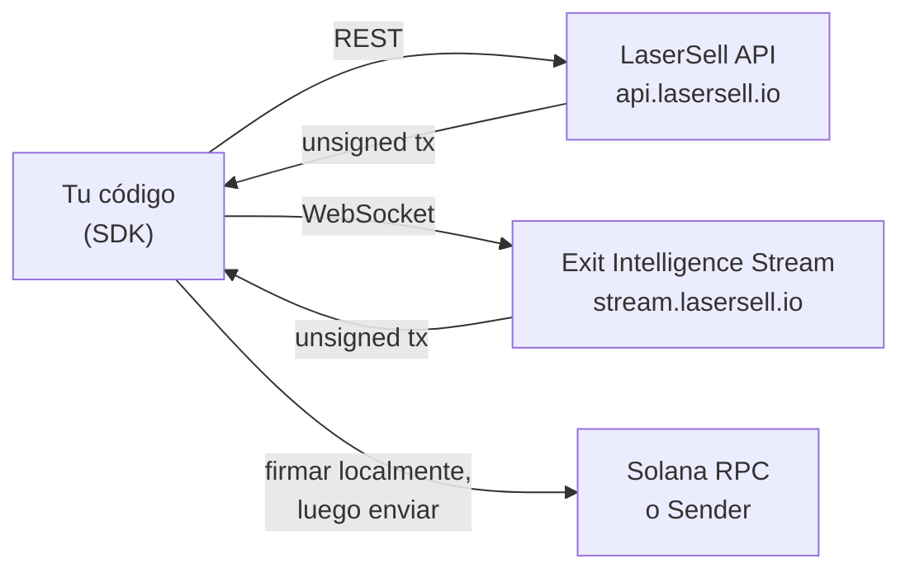

## ¿Qué es LaserSell API?

LaserSell API te permite construir, firmar y enviar transacciones de swap en Solana de forma programática. Expone dos superficies:

- **LaserSell API** (REST): Construye transacciones sin firmar de compra y venta bajo demanda a través de `POST /v1/sell` y `POST /v1/buy`. Recupera los detalles de tu cuenta con `GET /v1/account` y consulta tu historial de operaciones con `GET /v1/history`.
- **Exit Intelligence Stream** (WebSocket): Conecta una sesión persistente que vigila tus wallets, rastrea posiciones, evalúa tu estrategia en tiempo real y entrega transacciones de salida preconstruidas cuando se alcanzan los umbrales.

Ambas superficies devuelven **transacciones sin firmar**. Tu clave privada nunca sale de tu máquina. Firmas localmente y luego envías a través del send target de tu elección.

## Modelo no custodial

LaserSell es completamente no custodial. El servidor construye instrucciones de swap optimizadas pero no puede ejecutarlas sin tu firma. Esto significa:

1. Tú mantienes el par de claves en todo momento.
2. La API devuelve una transacción sin firmar codificada en base64.
3. Firmas con tu par de claves local.
4. Envías a través de RPC, Helius Sender o Astralane.

Ningún fondo, token o clave es almacenado ni accedido por la infraestructura de LaserSell.

## Arquitectura de un vistazo

## Lenguajes del SDK

Los SDKs oficiales están disponibles en cuatro lenguajes, cada uno proporcionando las mismas capacidades:

| Lenguaje   | Paquete                          | Módulos                                        |
|------------|----------------------------------|-------------------------------------------------|
| TypeScript | `@lasersell/lasersell-sdk`       | `ExitApiClient`, `StreamClient`, `StreamSession`, tx helpers |
| Python     | `lasersell-sdk`                  | `ExitApiClient`, `StreamClient`, `StreamSession`, tx helpers |
| Rust       | `lasersell-sdk`                  | `exit_api`, `stream`, `tx`                      |
| Go         | `github.com/lasersell/lasersell-sdk/go` | `ExitAPIClient`, `stream.StreamClient`, `stream.StreamSession`, tx helpers |

Todos los SDKs comparten los mismos esquemas de solicitud y respuesta, tipos de error y comportamiento de reintentos. Elige el lenguaje que se adapte a tu stack y sigue la guía del SDK correspondiente.

## Qué leer a continuación

- [Autenticación](/api/authentication): Obtén tu clave API y comienza a hacer solicitudes.
- [Inicio rápido](/api/quickstart): Construye tu primera transacción de venta en menos de cinco minutos.
- [Exit Intelligence Stream](/api/stream/overview): Aprende cuándo usar el WebSocket stream en lugar de REST.
