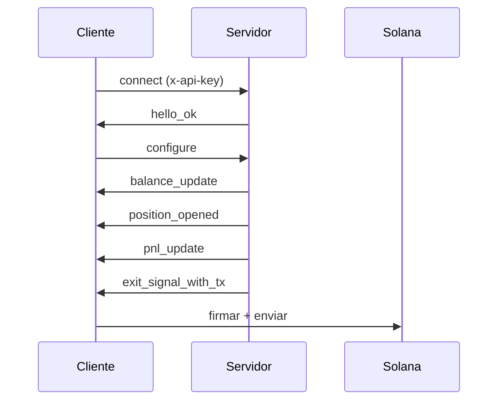

## ¿Qué es el Exit Intelligence Stream?

El Exit Intelligence Stream es una conexión WebSocket persistente que monitorea tus wallets en cadena, rastrea posiciones de tokens, evalúa tu estrategia de ganancias y pérdidas en tiempo real y entrega transacciones de salida sin firmar preconstruidas cuando se alcanzan tus umbrales.

Los suscriptores del nivel **Professional y Advanced** también reciben [instantáneas de liquidez](/api/stream/server-events#liquidity_snapshot) en tiempo real con bandas de slippage y datos de tendencia de liquidez, dándote visibilidad sobre cuánto de una posición puede venderse a un impacto de precio dado y si la liquidez del pool está creciendo, estable o drenándose. Lee el [anuncio completo](https://www.lasersell.io/blog/liquidity-snapshots-and-sdk-0-3) para detalles.

## Endpoint

```
wss://stream.lasersell.io/v1/ws
```

La autenticación se maneja a través del encabezado `x-api-key`, que los SDKs establecen automáticamente.

## Cuándo usar el Exit Intelligence Stream vs REST

| Escenario                                     | Usar                          |
|----------------------------------------------|------------------------------|
| Venta automática cuando se alcanza objetivo de ganancia/pérdida | Exit Intelligence Stream     |
| Transacción única de compra o venta           | REST (LaserSell API)         |
| Monitoreo continuo de posiciones              | Exit Intelligence Stream     |
| Construir una transacción para confirmación del usuario | REST (LaserSell API)         |
| Bot que reacciona a actividad de wallet       | Exit Intelligence Stream     |

Usa el **Exit Intelligence Stream** cuando quieras que el servidor vigile tus posiciones y entregue transacciones de salida automáticamente. Usa la **API REST** cuando necesites una sola transacción construida bajo demanda.

<Warning>
**Conecta el stream antes de comprar.** El Exit Intelligence Stream detecta nuevas posiciones observando llegadas de tokens en cadena. Si llamas a `/v1/buy` antes de que el stream esté conectado y configurado, la posición resultante no será rastreada y no se dispararán señales de salida. Siempre conecta y configura el stream primero, luego envía tu compra.
</Warning>

## Flujo de alto nivel

1. **Conectar** a `wss://stream.lasersell.io/v1/ws` con tu clave API.
2. Recibir `hello_ok` del servidor (incluye ID de sesión y límites de tasa).
3. **Enviar `configure`** con las claves públicas de wallets y tus parámetros de estrategia.
4. Recibir mensajes iniciales de `balance_update` para holdings de tokens existentes.
5. **El stream monitorea** tus wallets en busca de nuevas llegadas de tokens y rastrea ganancias y pérdidas.
6. Cuando una posición alcanza tu take profit, stop loss, trailing stop o deadline, el servidor envía un `exit_signal_with_tx`.
7. **Firmar localmente** y enviar la transacción sin firmar.



## Puntos de entrada del SDK

Los SDKs proporcionan dos niveles de abstracción:

- **`StreamClient`**: Cliente de bajo nivel. Gestiona la conexión WebSocket, reconexión y enmarcado de mensajes. Devuelve objetos `ServerMessage` crudos.
- **`StreamSession`**: Envoltorio de alto nivel. Envuelve `StreamClient` con seguimiento de posiciones, temporizadores de deadline, caché de instantáneas de liquidez y objetos `StreamEvent` tipados que incluyen un `PositionHandle`.

Para la mayoría de los casos de uso, comienza con `StreamSession`.

<CodeGroup>
```typescript TypeScript
import { StreamClient, StreamSession } from "@lasersell/lasersell-sdk";

const client = new StreamClient("YOUR_API_KEY");
const session = await StreamSession.connect(client, {
  wallet_pubkeys: ["WALLET_PUBKEY"],
  strategy: { target_profit_pct: 5, stop_loss_pct: 1.5 },
  deadline_timeout_sec: 45,
  send_mode: "helius_sender",
  tip_lamports: 1000,
});

while (true) {
  const event = await session.recv();
  if (event === null) break;
  // Handle event...
}
```

```python Python
from lasersell_sdk.stream.client import StreamClient, StreamConfigure
from lasersell_sdk.stream.session import StreamSession

client = StreamClient("YOUR_API_KEY")
session = await StreamSession.connect(
    client,
    StreamConfigure(
        wallet_pubkeys=["WALLET_PUBKEY"],
        strategy={"target_profit_pct": 5.0, "stop_loss_pct": 1.5},
        deadline_timeout_sec=45,
    ),
)

while True:
    event = await session.recv()
    if event is None:
        break
    # Handle event...
```

```rust Rust
use lasersell_sdk::stream::client::{StreamClient, StreamConfigure};
use lasersell_sdk::stream::session::StreamSession;
use lasersell_sdk::stream::proto::StrategyConfigMsg;
use secrecy::SecretString;

let client = StreamClient::new(SecretString::new(std::env::var("LASERSELL_API_KEY")?));
let session = StreamSession::connect(&client, StreamConfigure {
    wallet_pubkeys: vec!["WALLET_PUBKEY".into()],
    strategy: StrategyConfigMsg {
        target_profit_pct: 5.0,
        stop_loss_pct: 1.5,
        ..Default::default()
    },
    deadline_timeout_sec: Some(45),
}).await?;

loop {
    let event = match session.recv().await {
        Some(event) => event,
        None => break,
    };
    // Handle event...
}
```

```go Go
import "github.com/lasersell/lasersell-sdk/go/stream"

client := stream.NewStreamClient("YOUR_API_KEY")
session, err := stream.ConnectSession(ctx, client, stream.StreamConfigure{
    WalletPubkeys: []string{"WALLET_PUBKEY"},
    Strategy: stream.StrategyConfigMsg{
        TargetProfitPct: 5.0,
        StopLossPct:     1.5,
    },
    DeadlineTimeoutSec: 45,
})
if err != nil {
    log.Fatal(err)
}

for {
    event, err := session.Recv(ctx)
    if errors.Is(err, io.EOF) {
        break
    }
    // Handle event...
}
```
</CodeGroup>

## Siguientes pasos

- [Ciclo de vida de la conexión](/api/stream/connection-lifecycle): Handshake detallado, reconexión y lane splitting.
- [Configuración de estrategia](/api/stream/strategy-configuration): Configurar objetivos de ganancia, stop losses y trailing stops.
- [Eventos del servidor](/api/stream/server-events): Esquema completo para los 9 tipos de mensajes del servidor, incluyendo instantáneas de liquidez.
- [Mensajes del cliente](/api/stream/client-messages): Los 6 tipos de mensajes del cliente y sus esquemas.
