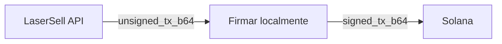

## Flujo no custodial

LaserSell nunca toca tu clave privada. Cada transacción sigue este patrón:

1. **Construir**: La API devuelve una `VersionedTransaction` sin firmar codificada en base64.
2. **Firmar**: Decodificas, firmas y recodificas localmente usando tu par de claves.
3. **Enviar**: Envías la transacción firmada a la red Solana a través de un [send target](/api/transactions/send-targets).

Para ejemplos completos de carga de pares de claves, funciones de firma y envío en los 4 SDKs, consulta la [documentación en inglés](/api/transactions/signing).

## Tipos de error

Los errores de firma y envío se exponen a través de `TxSubmitError`:

| Tipo                      | Descripción                                         |
|---------------------------|-----------------------------------------------------|
| `decode_unsigned_tx`      | Falló la decodificación base64 de la transacción sin firmar. |
| `deserialize_unsigned_tx` | Los bytes de la transacción no pudieron ser deserializados. |
| `sign_tx`                 | Falló la firma (par de claves incorrecto, datos corruptos). |
| `serialize_tx`            | Falló la serialización de la transacción firmada.    |
| `request_send`            | Error de red durante el envío.                       |
| `response_read`           | No se pudo leer el cuerpo de respuesta del RPC.      |
| `http_status`             | Respuesta HTTP no 2xx del endpoint RPC.              |
| `decode_response`         | El cuerpo de respuesta no era JSON válido.           |
| `rpc_error`               | El RPC devolvió un objeto de error.                  |
| `missing_result`          | La respuesta no contenía una firma de transacción.   |

## Mejores prácticas de seguridad

- **Nunca registres ni transmitas** tu clave privada.
- **Carga claves desde variables de entorno** o archivos cifrados en producción.
- **Verifica la dirección de wallet** que coincida con el `user_pubkey` usado en la solicitud de construcción. La API construye la transacción para ese firmante específico.
