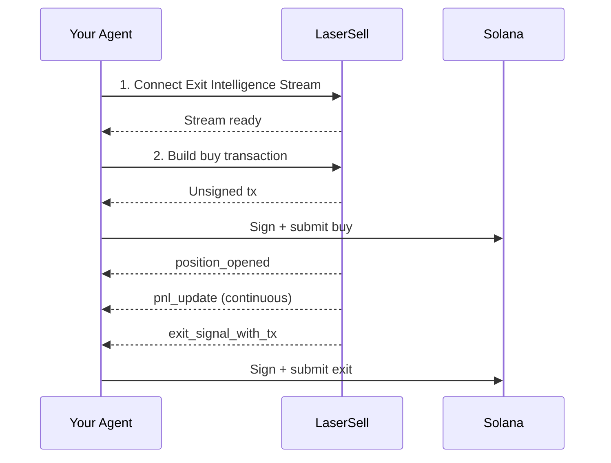

このガイドでは、LaserSellを実行レイヤーとして使用してSolanaトークンを自律的に取引できるAIエージェントの構築方法を説明します。エージェントは意思決定（いつ購入するか、どの戦略を使うか）を担当し、LaserSellはそれ以外のすべて（プロトコルルーティング、ポジション監視、PnL追跡、自動エグジット実行）を処理します。

このパターンは、エージェントの構築方法に関係なく機能します。[OpenClaw](https://openclaw.ai/)のような個人用AIアシスタントにトレーディングスキルを追加する場合でも、スタンドアロンのトレーディングボットを構築する場合でも、Telegramボットフレームワークに統合する場合でも、LangChain、CrewAI、その他のフレームワークで構築されたエージェントを接続する場合でも、LaserSellの統合は同じです。エージェントがAPIを呼び出し、ストリームに接続し、トランザクションに署名します。残りはあなた次第です。

## エージェントが行うこと

1. **接続** Exit Intelligence Streamに接続して監視を開始。
2. **購入** REST APIを通じてトランザクションを構築・送信してトークンを購入。
3. **監視** ストリーム経由で自動的にポジションを監視（PnL更新、価格追跡）。
4. **エグジット** 戦略条件が満たされたときにエグジット（テイクプロフィット、ストップロス、トレーリングストップ、またはデッドライン）。

エージェントはトークンがどのDEXやローンチパッド上にあるかを知る必要がありません。LaserSellがプロトコルを解決し、トランザクションを構築し、リアルタイムでエグジットシグナルを配信します。

## 前提条件

- LaserSell APIキー（[こちらで取得](https://app.lasersell.io)）。
- Solanaキーペア（JSONバイト配列ファイル）。
- Python 3.10以上とLaserSell SDKがインストール済み。

```bash
pip install lasersell-sdk[tx,stream]
```

以下の例はPythonを使用していますが、同じフローは[TypeScript](/api/sdk/typescript)、[Rust](/api/sdk/rust)、[Go](/api/sdk/go) SDKでも適用されます。

## アーキテクチャ



エージェントが意思決定を担当し、LaserSellが実行を担当します。両者の境界は明確です: エージェントはリクエストを送信しイベントを受信します。すべてのトランザクションは未署名で、エージェントがローカルで署名します。

## ステップ1: Exit Intelligence Streamに接続

ストリームはエージェントが購入する**前に**接続する必要があります。ストリームはオンチェーンのトークン到着をリアルタイムで監視することでポジションを検出します。ストリームが接続される前に購入がランディングすると、ポジションは追跡されません。

```python
import asyncio
import json
import os
from pathlib import Path
from solders.keypair import Keypair
from lasersell_sdk.stream.client import StreamClient, StreamConfigure
from lasersell_sdk.stream.session import StreamSession

api_key = os.environ["LASERSELL_API_KEY"]
keypair_bytes = json.loads(Path("./keypair.json").read_text())
signer = Keypair.from_bytes(bytes(keypair_bytes))
wallet_pubkey = str(signer.pubkey())

# Connect and configure the stream
stream_client = StreamClient(api_key)
session = await StreamSession.connect(
    stream_client,
    StreamConfigure(
        wallet_pubkeys=[wallet_pubkey],
        strategy={
            "target_profit_pct": 10.0,
            "stop_loss_pct": 5.0,
            "trailing_stop_pct": 3.0,
            "sell_on_graduation": True,
        },
        deadline_timeout_sec=120,
        send_mode="helius_sender",
        tip_lamports=1000,
    ),
)
```

戦略設定はLaserSellにエグジットシグナルを生成するタイミングを伝えます:

| パラメータ | 値 | 意味 |
|-----------|-------|---------|
| `target_profit_pct` | `10.0` | 利益が10%に達したら売却。 |
| `stop_loss_pct` | `5.0` | 損失が5%に達したら売却。 |
| `trailing_stop_pct` | `3.0` | 利益がピークから3%下落したら売却。 |
| `sell_on_graduation` | `true` | トークンがボンディングカーブからAMMに移行したら売却。 |
| `deadline_timeout_sec` | `120` | 他の条件が発動しない場合、120秒後に強制売却。 |

エージェントは独自のロジックに基づいてこれらを動的に調整できます。[戦略設定](/api/stream/strategy-configuration)を参照してください。

## ステップ2: 購入の構築と送信

ストリームが接続されたら、エージェントはトークンを購入できます。REST APIがエージェントがローカルで署名して送信する未署名トランザクションを構築します。

```python
from lasersell_sdk.exit_api import ExitApiClient, BuildBuyTxRequest
from lasersell_sdk.tx import SendTargetHeliusSender, send_transaction, sign_unsigned_tx

api_client = ExitApiClient.with_api_key(api_key)

# Build the unsigned buy transaction
buy_request = BuildBuyTxRequest(
    mint="TOKEN_MINT_ADDRESS",
    user_pubkey=wallet_pubkey,
    amount=0.1,  # 0.1 SOL
    slippage_bps=2_000,              # 20% slippage tolerance
)
response = await api_client.build_buy_tx(buy_request)

# Sign locally and submit
signed_tx = sign_unsigned_tx(response.tx, signer)
signature = await send_transaction(SendTargetHeliusSender(), signed_tx)
print(f"Buy submitted: {signature}")
```

エージェントは秘密鍵をどこにも送信しません。LaserSellが未署名トランザクションを返し、エージェントがローカルで署名し、Helius Sender経由でSolanaネットワークに直接送信します。

## ステップ3: 監視と自動エグジット

購入がオンチェーンでランディングした後、Exit Intelligence Streamが新しいトークン残高を検出してポジションの追跡を開始します。エージェントはイベントをリッスンし、エグジットシグナルに対応します。

```python
from lasersell_sdk.tx import SendTargetHeliusSender, send_transaction, sign_unsigned_tx

while True:
    event = await session.recv()
    if event is None:
        break  # Stream disconnected

    if event.type == "position_opened":
        handle = event.handle
        print(f"Position opened: {handle.mint}")
        print(f"  Token account: {handle.token_account}")

    elif event.type == "pnl_update":
        msg = event.message
        pnl_pct = msg["pnl_pct"]
        print(f"PnL update: {pnl_pct:.2f}%")

    elif event.type == "exit_signal_with_tx":
        msg = event.message  # TypedDict, use dict access
        reason = msg["reason"]
        print(f"Exit signal fired: {reason}")

        # Sign and submit the pre-built exit transaction
        signed_tx = sign_unsigned_tx(str(msg["unsigned_tx_b64"]), signer)
        sig = await send_transaction(SendTargetHeliusSender(), signed_tx)
        print(f"Exit submitted: {sig}")

    elif event.type == "position_closed":
        msg = event.message
        print(f"Position closed: {msg['reason']}")
```

主要なイベント:

| イベント | 意味 |
|-------|---------------|
| `position_opened` | 新しいトークンがウォレットに到着。追跡が開始。 |
| `pnl_update` | ポジションの定期的な損益スナップショット。 |
| `exit_signal_with_tx` | 戦略条件が満たされた。署名して送信する準備ができた事前構築済み未署名エグジットトランザクションを含む。 |
| `position_closed` | ポジションの追跡が終了（売却、転送、または手動クローズ）。 |

## ステップ4: セッション中の戦略更新

エージェントは独自のロジックに基づいていつでも戦略パラメータを調整できます。例えば、ポジションが利益を出した後にトレーリングストップを引き締めたり、エージェントがより長く保有すると決定した場合にデッドラインを無効にしたりできます。

```python
# Tighten trailing stop after detecting strong momentum
session.sender().update_strategy({
    "target_profit_pct": 15.0,
    "stop_loss_pct": 3.0,
    "trailing_stop_pct": 2.0,
})
```

更新はすべての追跡中のポジションに即座に反映されます。再接続は不要です。

## 完全な動作例

すべてのステップを組み合わせた完全なエージェントループ:

```python
import asyncio
import json
import os
from pathlib import Path
from solders.keypair import Keypair
from lasersell_sdk.exit_api import ExitApiClient, BuildBuyTxRequest
from lasersell_sdk.stream.client import StreamClient, StreamConfigure
from lasersell_sdk.stream.session import StreamSession
from lasersell_sdk.tx import SendTargetHeliusSender, send_transaction, sign_unsigned_tx


async def run_agent(mint: str, amount_sol: float):
    api_key = os.environ["LASERSELL_API_KEY"]
    signer = Keypair.from_bytes(
        bytes(json.loads(Path("./keypair.json").read_text()))
    )
    wallet_pubkey = str(signer.pubkey())

    # --- 1. Connect the Exit Intelligence Stream ---
    stream_client = StreamClient(api_key)
    session = await StreamSession.connect(
        stream_client,
        StreamConfigure(
            wallet_pubkeys=[wallet_pubkey],
            strategy={
                "target_profit_pct": 10.0,
                "stop_loss_pct": 5.0,
                "trailing_stop_pct": 3.0,
                "sell_on_graduation": True,
            },
            deadline_timeout_sec=120,
        ),
    )

    # --- 2. Build and submit the buy ---
    api_client = ExitApiClient.with_api_key(api_key)
    buy_request = BuildBuyTxRequest(
        mint=mint,
        user_pubkey=wallet_pubkey,
        amount=amount_sol,
        slippage_bps=2_000,
    )
    response = await api_client.build_buy_tx(buy_request)
    signed_tx = sign_unsigned_tx(response.tx, signer)
    buy_sig = await send_transaction(SendTargetHeliusSender(), signed_tx)
    print(f"Buy submitted: {buy_sig}")

    # --- 3. Listen for events and handle exits ---
    while True:
        event = await session.recv()
        if event is None:
            print("Stream disconnected")
            break

        if event.type == "position_opened":
            print(f"Tracking position: {event.handle.mint}")

        elif event.type == "exit_signal_with_tx":
            msg = event.message
            print(f"Exit signal: {msg['reason']}")
            signed_tx = sign_unsigned_tx(str(msg["unsigned_tx_b64"]), signer)
            sig = await send_transaction(SendTargetHeliusSender(), signed_tx)
            print(f"Exit submitted: {sig}")
            break  # Position exited, agent is done

        elif event.type == "position_closed":
            print(f"Position closed: {event.message['reason']}")
            break


asyncio.run(run_agent(
    mint="TOKEN_MINT_ADDRESS",
    amount_sol=0.1,  # 0.1 SOL
))
```

## このパターンの拡張

このガイドでは単一の購入とエグジットのサイクルを示しています。本番のエージェントはこの基盤の上に構築するでしょう:

**シグナル統合。** エージェントは任意のソースから購入シグナルを受け取ります: ユーザーのプロンプト、オンチェーン分析、ソーシャルフィード、コピートレーディングのリーダー、別のAIモデル。シグナルが`build_buy_tx`を呼び出すタイミングを決定します。

**マルチポジション管理。** ストリームは1つまたは複数のウォレットにわたって複数のポジションを同時に追跡します。エージェントはアクティブなポジションのポートフォリオを管理でき、それぞれ独自のエントリーロジックを持ちながら、LaserSellがすべてのエグジット条件を並行して評価します。

**ダイナミック戦略。** `update_strategy`を使用して、市場状況、ポジションのパフォーマンス、エージェントの確信度に基づいてパラメータを調整します。高いボラティリティを検出したエージェントはストップを引き締めるかもしれません。強いトレンドを検出したエージェントはストップを広げるかもしれません。

**リスクコントロール。** APIを呼び出す前に、エージェントの意思決定レイヤーでポジションサイジング、最大同時ポジション数、日次損失制限、その他のリスクルールを適用します。

**MCP統合。** エージェントが[OpenClaw](https://openclaw.ai/)、Claude、Cursor、その他のAIアシスタントなどのMCP互換クライアント内で実行されている場合、統合の構築やデバッグ中に[LaserSell MCPサーバー](/ai-agents/mcp-server)を使用してリアルタイムでドキュメント、APIスキーマ、コード例を調べることができます。

## 次のステップ

- [API概要](/api/overview): APIの全体像。
- [Exit Intelligence Stream](/api/stream/overview): ストリームプロトコルの詳細。
- [戦略設定](/api/stream/strategy-configuration): すべての戦略パラメータ。
- [トランザクション署名](/api/transactions/signing): 署名と送信の詳細。
- [MCPサーバー](/ai-agents/mcp-server): AIエージェントにLaserSellドキュメントへのアクセスを提供。
