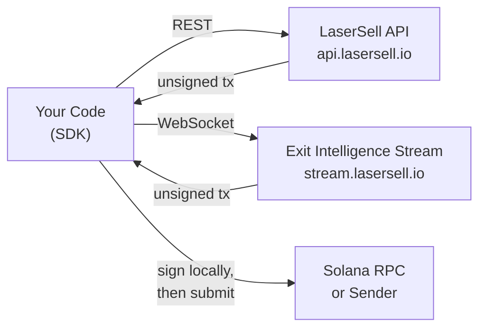

## LaserSell APIとは？

LaserSell APIを使用すると、Solanaスワップトランザクションをプログラムで構築、署名、送信できます。2つのサーフェスを公開しています:

- **LaserSell API**（REST）: `POST /v1/sell`と`POST /v1/buy`を通じてオンデマンドで未署名の売買トランザクションを構築します。`GET /v1/account`でアカウント詳細を取得し、`GET /v1/history`で取引履歴をクエリします。
- **Exit Intelligence Stream**（WebSocket）: ウォレットを監視し、ポジションを追跡し、リアルタイムで戦略を評価し、閾値に達したときに事前構築されたエグジットトランザクションを配信する持続的なセッションを接続します。

両方のサーフェスは**未署名トランザクション**を返します。秘密鍵がマシンから離れることはありません。ローカルで署名し、選択した送信ターゲットを通じて送信します。

## ノンカストディアルモデル

LaserSellは完全にノンカストディアルです。サーバーは最適化されたスワップ命令を構築しますが、あなたの署名なしでは実行できません。つまり:

1. キーペアは常にあなたが保持します。
2. APIはbase64エンコードされた未署名トランザクションを返します。
3. ローカルキーペアで署名します。
4. RPC、Helius Sender、またはAstralaneを通じて送信します。

LaserSellのインフラストラクチャに資金、トークン、鍵が保存またはアクセスされることはありません。

## アーキテクチャの概要

## SDK言語

4つの言語で公式SDKが利用可能で、それぞれ同じ機能を提供します:

| 言語 | パッケージ | モジュール |
|------------|----------------------------------|-------------------------------------------------|
| TypeScript | `@lasersell/lasersell-sdk`       | `ExitApiClient`, `StreamClient`, `StreamSession`, txヘルパー |
| Python     | `lasersell-sdk`                  | `ExitApiClient`, `StreamClient`, `StreamSession`, txヘルパー |
| Rust       | `lasersell-sdk`                  | `exit_api`, `stream`, `tx`                      |
| Go         | `github.com/lasersell/lasersell-sdk/go` | `ExitAPIClient`, `stream.StreamClient`, `stream.StreamSession`, txヘルパー |

すべてのSDKは同じリクエストとレスポンスのスキーマ、エラータイプ、リトライ動作を共有しています。スタックに合った言語を選択し、対応するSDKガイドに従ってください。

## 次に読むべきもの

- [認証](/api/authentication): APIキーを取得してリクエストを開始。
- [クイックスタート](/api/quickstart): 5分以内に最初の売却トランザクションを構築。
- [Exit Intelligence Stream](/api/stream/overview): RESTの代わりにWebSocketストリームを使用するタイミングを学ぶ。
