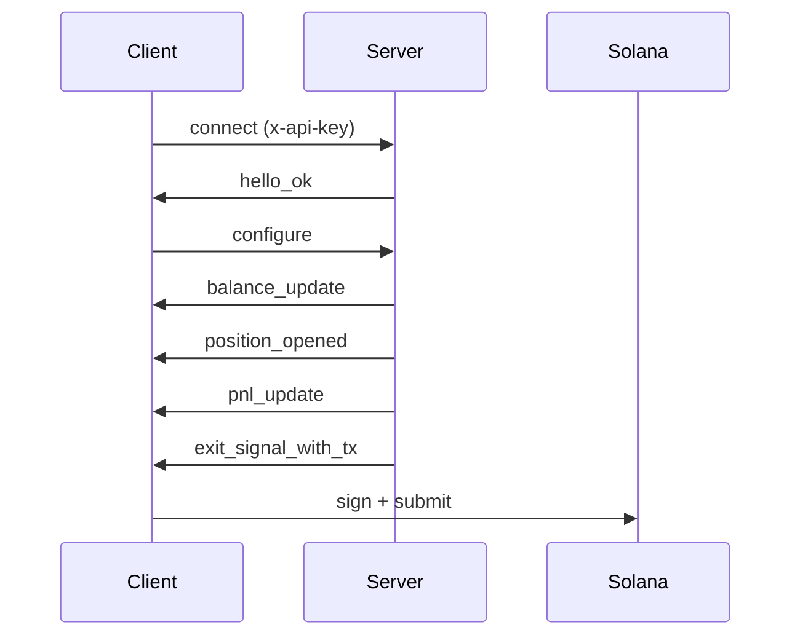

## Exit Intelligence Streamとは？

Exit Intelligence Streamは、ウォレットをオンチェーンで監視し、トークンポジションを追跡し、リアルタイムで損益戦略を評価し、閾値に達したときに事前構築された未署名エグジットトランザクションを配信する持続的なWebSocket接続です。

**ProfessionalおよびAdvancedティア**のサブスクライバーは、スリッページバンドと流動性トレンドデータを含むリアルタイムの[流動性スナップショット](/api/stream/server-events#liquidity_snapshot)も受信し、特定の価格インパクトでポジションのどれだけを売却できるか、プール流動性が増加、安定、減少しているかの可視性を得られます。詳細は[完全なアナウンス](https://www.lasersell.io/blog/liquidity-snapshots-and-sdk-0-3)を参照してください。

## エンドポイント

```
wss://stream.lasersell.io/v1/ws
```

認証は`x-api-key`ヘッダーを通じて処理され、SDKが自動的に設定します。

## Exit Intelligence StreamとRESTの使い分け

| シナリオ | 使用するもの |
|----------------------------------------------|------------------------------|
| 損益ターゲット到達時の自動売却 | Exit Intelligence Stream |
| 単発の売買トランザクション | REST（LaserSell API） |
| 継続的なポジション監視 | Exit Intelligence Stream |
| ユーザー確認用のトランザクション構築 | REST（LaserSell API） |
| ウォレットアクティビティに反応するボット | Exit Intelligence Stream |

サーバーにポジションを監視させエグジットトランザクションを自動配信させたい場合は**Exit Intelligence Stream**を使用してください。オンデマンドで単一のトランザクションを構築する必要がある場合は**REST API**を使用してください。

<Warning>
**購入前にストリームを接続してください。** Exit Intelligence Streamはオンチェーンのトークン到着を観察して新しいポジションを検出します。ストリームが接続・設定される前に`/v1/buy`を呼び出すと、結果のポジションは追跡されず、エグジットシグナルは発火しません。常にストリームを先に接続・設定し、その後購入を送信してください。
</Warning>

## 高レベルフロー

1. APIキーを使用して`wss://stream.lasersell.io/v1/ws`に**接続**。
2. サーバーから`hello_ok`を受信（セッションIDとレート制限を含む）。
3. ウォレット公開鍵と戦略パラメータを含む**`configure`を送信**。
4. 既存のトークン保有に対する初期`balance_update`メッセージを受信。
5. **ストリームが監視**: 新しいトークン到着のためにウォレットを監視し、損益を追跡。
6. ポジションがテイクプロフィット、ストップロス、トレーリングストップ、またはデッドラインに達すると、サーバーが`exit_signal_with_tx`を送信。
7. 未署名トランザクションを**ローカルで署名**して送信。



## SDKエントリーポイント

SDKは2つの抽象化レベルを提供します:

- **`StreamClient`**: 低レベルクライアント。WebSocket接続、再接続、メッセージフレーミングを管理。生の`ServerMessage`オブジェクトを返します。
- **`StreamSession`**: 高レベルラッパー。`StreamClient`をポジション追跡、デッドラインタイマー、流動性スナップショットキャッシング、`PositionHandle`を含む型付き`StreamEvent`オブジェクトでラップします。

ほとんどのユースケースでは`StreamSession`から始めてください。

<CodeGroup>
```typescript TypeScript
import { StreamClient, StreamSession } from "@lasersell/lasersell-sdk";

const client = new StreamClient("YOUR_API_KEY");
const session = await StreamSession.connect(client, {
  wallet_pubkeys: ["WALLET_PUBKEY"],
  strategy: { target_profit_pct: 5, stop_loss_pct: 1.5 },
  deadline_timeout_sec: 45,
  send_mode: "helius_sender",
  tip_lamports: 1000,
});

while (true) {
  const event = await session.recv();
  if (event === null) break;
  // Handle event...
}
```

```python Python
from lasersell_sdk.stream.client import StreamClient, StreamConfigure
from lasersell_sdk.stream.session import StreamSession

client = StreamClient("YOUR_API_KEY")
session = await StreamSession.connect(
    client,
    StreamConfigure(
        wallet_pubkeys=["WALLET_PUBKEY"],
        strategy={"target_profit_pct": 5.0, "stop_loss_pct": 1.5},
        deadline_timeout_sec=45,
    ),
)

while True:
    event = await session.recv()
    if event is None:
        break
    # Handle event...
```

```rust Rust
use lasersell_sdk::stream::client::{StreamClient, StreamConfigure};
use lasersell_sdk::stream::session::StreamSession;
use lasersell_sdk::stream::proto::StrategyConfigMsg;
use secrecy::SecretString;

let client = StreamClient::new(SecretString::new(std::env::var("LASERSELL_API_KEY")?));
let session = StreamSession::connect(&client, StreamConfigure {
    wallet_pubkeys: vec!["WALLET_PUBKEY".into()],
    strategy: StrategyConfigMsg {
        target_profit_pct: 5.0,
        stop_loss_pct: 1.5,
        ..Default::default()
    },
    deadline_timeout_sec: Some(45),
}).await?;

loop {
    let event = match session.recv().await {
        Some(event) => event,
        None => break,
    };
    // Handle event...
}
```

```go Go
import "github.com/lasersell/lasersell-sdk/go/stream"

client := stream.NewStreamClient("YOUR_API_KEY")
session, err := stream.ConnectSession(ctx, client, stream.StreamConfigure{
    WalletPubkeys: []string{"WALLET_PUBKEY"},
    Strategy: stream.StrategyConfigMsg{
        TargetProfitPct: 5.0,
        StopLossPct:     1.5,
    },
    DeadlineTimeoutSec: 45,
})
if err != nil {
    log.Fatal(err)
}

for {
    event, err := session.Recv(ctx)
    if errors.Is(err, io.EOF) {
        break
    }
    // Handle event...
}
```
</CodeGroup>

## 次のステップ

- [接続ライフサイクル](/api/stream/connection-lifecycle): ハンドシェイク、再接続、レーンスプリッティングの詳細。
- [戦略設定](/api/stream/strategy-configuration): プロフィットターゲット、ストップロス、トレーリングストップの設定。
- [サーバーイベント](/api/stream/server-events): 流動性スナップショットを含む9種類のサーバーメッセージの完全なスキーマ。
- [クライアントメッセージ](/api/stream/client-messages): 6種類のクライアントメッセージとそのスキーマ。
