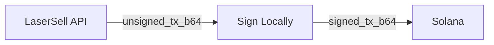

トランザクション署名の完全なフロー、キーペア読み込みコード、署名関数、送信方法、エラータイプについては、[英語版ドキュメント](/api/transactions/signing)を参照してください。

## ノンカストディアルフロー

LaserSellは秘密鍵に触れません。すべてのトランザクションは以下のパターンに従います:

1. **構築**: APIがbase64エンコードされた未署名`VersionedTransaction`を返します。
2. **署名**: キーペアを使用してローカルでデコード、署名、再エンコードします。
3. **送信**: 署名済みトランザクションを[送信ターゲット](/api/transactions/send-targets)を通じてSolanaネットワークに送信します。

