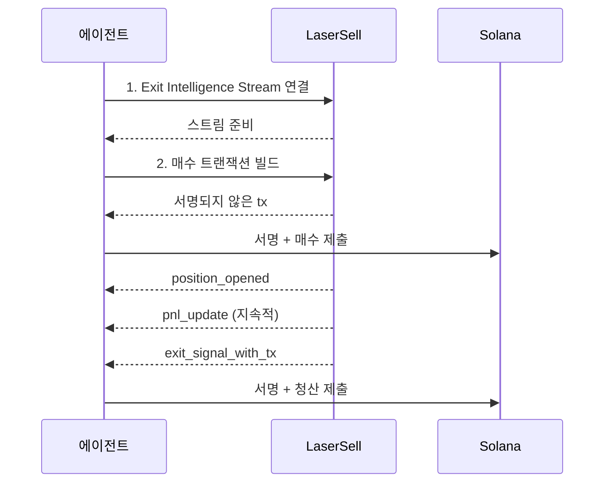

이 가이드는 LaserSell을 실행 레이어로 사용하여 Solana 토큰을 자율적으로 거래할 수 있는 AI 에이전트 구축 과정을 안내합니다. 에이전트는 의사 결정(언제 매수할지, 어떤 전략을 사용할지)을 담당하고, LaserSell은 프로토콜 라우팅, 포지션 모니터링, 손익 추적, 자동 청산 실행을 포함한 나머지 모든 것을 처리합니다.

이 패턴은 에이전트가 어떻게 구축되었는지에 관계없이 작동합니다. [OpenClaw](https://openclaw.ai/) 같은 개인 AI 어시스턴트에 거래 스킬을 확장하든, 독립형 트레이딩 봇을 구축하든, Telegram 봇 프레임워크에 통합하든, LangChain, CrewAI 또는 기타 프레임워크로 구축된 에이전트를 연결하든, LaserSell 통합은 동일합니다. 에이전트가 API를 호출하고, 스트림에 연결하고, 트랜잭션에 서명합니다. 나머지는 사용자에게 달려 있습니다.

## 에이전트가 할 일

1. **연결** Exit Intelligence Stream에 연결하여 모니터링을 시작합니다.
2. **매수** REST API를 통해 트랜잭션을 빌드하고 제출하여 토큰을 매수합니다.
3. **모니터링** 스트림을 통해 자동으로 포지션을 모니터링합니다(손익 업데이트, 가격 추적).
4. **청산** 전략 조건이 충족되면(목표 수익, 손절매, 트레일링 스탑 또는 데드라인) 청산합니다.

에이전트는 토큰이 어떤 DEX 또는 런치패드에 있는지 알 필요가 없습니다. LaserSell이 프로토콜을 해결하고, 트랜잭션을 빌드하고, 실시간으로 청산 신호를 전달합니다.

## 사전 요구사항

- LaserSell API 키 ([여기서 발급](https://app.lasersell.io)).
- Solana 키페어 (JSON 바이트 배열 파일).
- Python 3.10+ 및 LaserSell SDK 설치.

```bash
pip install lasersell-sdk[tx,stream]
```

아래 예제는 Python을 사용하지만, [TypeScript](/api/sdk/typescript), [Rust](/api/sdk/rust), [Go](/api/sdk/go) SDK에서도 동일한 흐름이 적용됩니다.

## 아키텍처



에이전트가 결정을 소유합니다. LaserSell이 실행을 소유합니다. 둘 사이의 경계는 깔끔합니다: 에이전트가 요청을 보내고 이벤트를 받습니다. 모든 트랜잭션은 서명되지 않은 상태이며 에이전트가 로컬에서 서명합니다.

## 단계 1: Exit Intelligence Stream 연결

스트림은 에이전트가 매수하기 **전에** 연결되어야 합니다. 스트림은 온체인에서 실시간으로 토큰 도착을 감시하여 포지션을 감지합니다. 스트림이 연결되기 전에 매수가 랜딩하면 포지션이 추적되지 않습니다.

```python
import asyncio
import json
import os
from pathlib import Path
from solders.keypair import Keypair
from lasersell_sdk.stream.client import StreamClient, StreamConfigure
from lasersell_sdk.stream.session import StreamSession

api_key = os.environ["LASERSELL_API_KEY"]
keypair_bytes = json.loads(Path("./keypair.json").read_text())
signer = Keypair.from_bytes(bytes(keypair_bytes))
wallet_pubkey = str(signer.pubkey())

# 스트림 연결 및 구성
stream_client = StreamClient(api_key)
session = await StreamSession.connect(
    stream_client,
    StreamConfigure(
        wallet_pubkeys=[wallet_pubkey],
        strategy={
            "target_profit_pct": 10.0,
            "stop_loss_pct": 5.0,
            "trailing_stop_pct": 3.0,
            "sell_on_graduation": True,
        },
        deadline_timeout_sec=120,
        send_mode="helius_sender",
        tip_lamports=1000,
    ),
)
```

전략 구성은 LaserSell에게 청산 신호를 생성할 시기를 알려줍니다:

| 매개변수 | 값 | 의미 |
|-----------|-------|---------|
| `target_profit_pct` | `10.0` | 수익이 10%에 도달하면 매도. |
| `stop_loss_pct` | `5.0` | 손실이 5%에 도달하면 매도. |
| `trailing_stop_pct` | `3.0` | 수익이 최고점에서 3% 하락하면 매도. |
| `sell_on_graduation` | `true` | 토큰이 본딩 커브에서 AMM으로 마이그레이션되면 매도. |
| `deadline_timeout_sec` | `120` | 다른 조건이 발동하지 않으면 120초 후 강제 매도. |

에이전트는 자체 로직에 따라 이를 동적으로 조정할 수 있습니다. [전략 구성](/api/stream/strategy-configuration)을 참조하세요.

## 단계 2: 매수 빌드 및 제출

스트림이 연결되면 에이전트가 토큰을 매수할 수 있습니다. REST API가 에이전트가 로컬에서 서명하고 제출하는 서명되지 않은 트랜잭션을 빌드합니다.

```python
from lasersell_sdk.exit_api import ExitApiClient, BuildBuyTxRequest
from lasersell_sdk.tx import SendTargetHeliusSender, send_transaction, sign_unsigned_tx

api_client = ExitApiClient.with_api_key(api_key)

# 서명되지 않은 매수 트랜잭션 빌드
buy_request = BuildBuyTxRequest(
    mint="TOKEN_MINT_ADDRESS",
    user_pubkey=wallet_pubkey,
    amount=0.1,  # 0.1 SOL
    slippage_bps=2_000,              # 20% 슬리피지 허용
)
response = await api_client.build_buy_tx(buy_request)

# 로컬에서 서명 및 제출
signed_tx = sign_unsigned_tx(response.tx, signer)
signature = await send_transaction(SendTargetHeliusSender(), signed_tx)
print(f"Buy submitted: {signature}")
```

에이전트는 개인키를 어디에도 보내지 않습니다. LaserSell이 서명되지 않은 트랜잭션을 반환하고, 에이전트가 로컬에서 서명하고, Helius Sender를 통해 Solana 네트워크에 직접 제출합니다.

## 단계 3: 자동 모니터링 및 청산

매수가 온체인에 랜딩한 후, Exit Intelligence Stream이 새 토큰 잔액을 감지하고 포지션 추적을 시작합니다. 에이전트는 이벤트를 수신하고 청산 신호에 따라 행동합니다.

```python
from lasersell_sdk.tx import SendTargetHeliusSender, send_transaction, sign_unsigned_tx

while True:
    event = await session.recv()
    if event is None:
        break  # 스트림 연결 끊김

    if event.type == "position_opened":
        handle = event.handle
        print(f"Position opened: {handle.mint}")
        print(f"  Token account: {handle.token_account}")

    elif event.type == "pnl_update":
        msg = event.message
        pnl_pct = msg["pnl_pct"]
        print(f"PnL update: {pnl_pct:.2f}%")

    elif event.type == "exit_signal_with_tx":
        msg = event.message  # TypedDict, dict 접근 사용
        reason = msg["reason"]
        print(f"Exit signal fired: {reason}")

        # 사전 구축된 청산 트랜잭션 서명 및 제출
        signed_tx = sign_unsigned_tx(str(msg["unsigned_tx_b64"]), signer)
        sig = await send_transaction(SendTargetHeliusSender(), signed_tx)
        print(f"Exit submitted: {sig}")

    elif event.type == "position_closed":
        msg = event.message
        print(f"Position closed: {msg['reason']}")
```

주요 이벤트:

| 이벤트 | 의미 |
|-------|---------------|
| `position_opened` | 새 토큰이 지갑에 도착함. 추적이 시작됨. |
| `pnl_update` | 포지션에 대한 주기적 손익 스냅샷. |
| `exit_signal_with_tx` | 전략 조건이 충족됨. 서명하고 제출할 준비가 된 사전 구축된 서명되지 않은 청산 트랜잭션 포함. |
| `position_closed` | 포지션이 더 이상 추적되지 않음(매도, 전송 또는 수동 종료). |

## 단계 4: 세션 중 전략 업데이트

에이전트는 자체 로직에 따라 언제든지 전략 매개변수를 조정할 수 있습니다. 예를 들어, 포지션이 수익을 낸 후 트레일링 스탑을 촘촘히 하거나, 에이전트가 더 오래 보유하기로 결정하면 데드라인을 비활성화하는 것입니다.

```python
# 강한 모멘텀 감지 후 트레일링 스탑 촘촘히 조정
session.sender().update_strategy({
    "target_profit_pct": 15.0,
    "stop_loss_pct": 3.0,
    "trailing_stop_pct": 2.0,
})
```

업데이트는 모든 추적 중인 포지션에 즉시 적용됩니다. 재연결이 필요 없습니다.

## 전체 작동 예제

모든 단계를 결합한 완전한 에이전트 루프입니다:

```python
import asyncio
import json
import os
from pathlib import Path
from solders.keypair import Keypair
from lasersell_sdk.exit_api import ExitApiClient, BuildBuyTxRequest
from lasersell_sdk.stream.client import StreamClient, StreamConfigure
from lasersell_sdk.stream.session import StreamSession
from lasersell_sdk.tx import SendTargetHeliusSender, send_transaction, sign_unsigned_tx


async def run_agent(mint: str, amount_sol: float):
    api_key = os.environ["LASERSELL_API_KEY"]
    signer = Keypair.from_bytes(
        bytes(json.loads(Path("./keypair.json").read_text()))
    )
    wallet_pubkey = str(signer.pubkey())

    # --- 1. Exit Intelligence Stream 연결 ---
    stream_client = StreamClient(api_key)
    session = await StreamSession.connect(
        stream_client,
        StreamConfigure(
            wallet_pubkeys=[wallet_pubkey],
            strategy={
                "target_profit_pct": 10.0,
                "stop_loss_pct": 5.0,
                "trailing_stop_pct": 3.0,
                "sell_on_graduation": True,
            },
            deadline_timeout_sec=120,
        ),
    )

    # --- 2. 매수 빌드 및 제출 ---
    api_client = ExitApiClient.with_api_key(api_key)
    buy_request = BuildBuyTxRequest(
        mint=mint,
        user_pubkey=wallet_pubkey,
        amount=amount_sol,
        slippage_bps=2_000,
    )
    response = await api_client.build_buy_tx(buy_request)
    signed_tx = sign_unsigned_tx(response.tx, signer)
    buy_sig = await send_transaction(SendTargetHeliusSender(), signed_tx)
    print(f"Buy submitted: {buy_sig}")

    # --- 3. 이벤트 수신 및 청산 처리 ---
    while True:
        event = await session.recv()
        if event is None:
            print("Stream disconnected")
            break

        if event.type == "position_opened":
            print(f"Tracking position: {event.handle.mint}")

        elif event.type == "exit_signal_with_tx":
            msg = event.message
            print(f"Exit signal: {msg['reason']}")
            signed_tx = sign_unsigned_tx(str(msg["unsigned_tx_b64"]), signer)
            sig = await send_transaction(SendTargetHeliusSender(), signed_tx)
            print(f"Exit submitted: {sig}")
            break  # 포지션 청산 완료, 에이전트 종료

        elif event.type == "position_closed":
            print(f"Position closed: {event.message['reason']}")
            break


asyncio.run(run_agent(
    mint="TOKEN_MINT_ADDRESS",
    amount_sol=0.1,  # 0.1 SOL
))
```

## 이 패턴 확장

이 가이드는 단일 매수 및 청산 사이클을 보여줍니다. 프로덕션 에이전트는 이 기반 위에 구축합니다:

**시그널 통합.** 에이전트가 모든 소스에서 매수 시그널을 받습니다: 사용자 프롬프트, 온체인 분석, 소셜 피드, 카피 트레이딩 리더, 또는 다른 AI 모델. 시그널이 `build_buy_tx`를 호출할 시기를 결정합니다.

**다중 포지션 관리.** 스트림은 하나 이상의 지갑에서 여러 포지션을 동시에 추적합니다. 에이전트는 각각 자체 진입 로직을 가진 활성 포지션의 포트폴리오를 관리할 수 있으며, LaserSell이 모든 포지션에서 청산 조건을 병렬로 평가합니다.

**동적 전략.** `update_strategy`를 사용하여 시장 조건, 포지션 성과, 에이전트 신뢰도에 따라 매개변수를 조정합니다. 높은 변동성을 감지하는 에이전트는 스탑을 촘촘히 할 수 있습니다. 강한 추세를 감지하는 에이전트는 스탑을 넓힐 수 있습니다.

**위험 제어.** API를 호출하기 전에 에이전트의 의사 결정 레이어에서 포지션 크기, 최대 동시 포지션, 일일 손실 한도 또는 기타 위험 규칙을 적용하세요.

**MCP 통합.** 에이전트가 [OpenClaw](https://openclaw.ai/), Claude, Cursor 또는 다른 AI 어시스턴트 같은 MCP 호환 클라이언트 내에서 실행되는 경우, [LaserSell MCP 서버](/ai-agents/mcp-server)를 사용하여 통합을 구축하거나 디버깅하는 동안 실시간으로 문서, API 스키마, 코드 예제를 조회할 수 있습니다.

## 다음 단계

- 전체 API 표면에 대한 [API 개요](/api/overview).
- 스트림 프로토콜 심층 분석을 위한 [Exit Intelligence Stream](/api/stream/overview).
- 모든 전략 매개변수에 대한 [전략 구성](/api/stream/strategy-configuration).
- 서명 및 제출 세부사항에 대한 [트랜잭션 서명](/api/transactions/signing).
- AI 에이전트에게 LaserSell 문서 접근을 제공하기 위한 [MCP 서버](/ai-agents/mcp-server).
