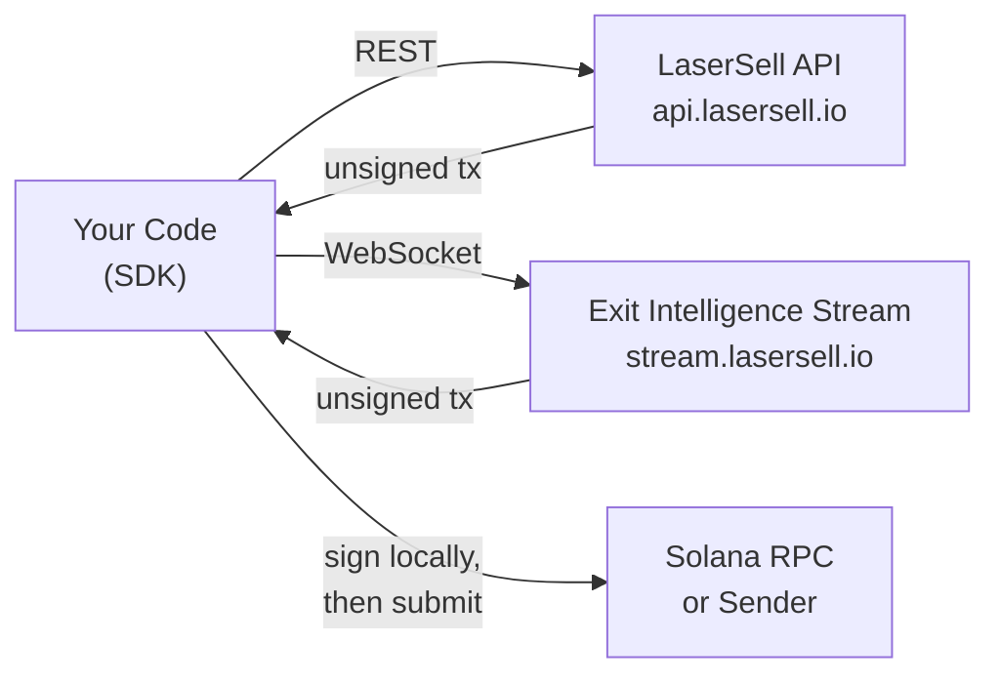

## LaserSell API란?

LaserSell API를 사용하면 프로그래밍 방식으로 Solana 스왑 트랜잭션을 빌드, 서명, 제출할 수 있습니다. 두 가지 표면을 노출합니다:

- **LaserSell API** (REST): `POST /v1/sell` 및 `POST /v1/buy`를 통해 요청 시 서명되지 않은 매수 및 매도 트랜잭션을 빌드합니다. `GET /v1/account`로 계정 세부정보를 조회하고 `GET /v1/history`로 거래 히스토리를 쿼리합니다.
- **Exit Intelligence Stream** (WebSocket): 지갑을 감시하고, 포지션을 추적하고, 실시간으로 전략을 평가하며, 임계값이 충족되면 사전 구축된 청산 트랜잭션을 전달하는 지속적인 세션을 연결합니다.

두 표면 모두 **서명되지 않은 트랜잭션**을 반환합니다. 개인키는 절대 기기를 떠나지 않습니다. 로컬에서 서명한 다음 선택한 전송 대상을 통해 제출합니다.

## 비수탁형 모델

LaserSell은 완전히 비수탁형입니다. 서버가 최적화된 스왑 인스트럭션을 구성하지만 서명 없이는 실행할 수 없습니다. 이는 다음을 의미합니다:

1. 항상 키페어를 보유합니다.
2. API가 base64로 인코딩된 서명되지 않은 트랜잭션을 반환합니다.
3. 로컬 키페어로 서명합니다.
4. RPC, Helius Sender 또는 Astralane을 통해 제출합니다.

LaserSell 인프라에 자금, 토큰, 키가 저장되거나 접근되지 않습니다.

## 아키텍처 개요

## SDK 언어

공식 SDK는 네 가지 언어로 제공되며, 각각 동일한 기능을 제공합니다:

| 언어   | 패키지                          | 모듈                                        |
|------------|----------------------------------|-------------------------------------------------|
| TypeScript | `@lasersell/lasersell-sdk`       | `ExitApiClient`, `StreamClient`, `StreamSession`, tx 헬퍼 |
| Python     | `lasersell-sdk`                  | `ExitApiClient`, `StreamClient`, `StreamSession`, tx 헬퍼 |
| Rust       | `lasersell-sdk`                  | `exit_api`, `stream`, `tx`                      |
| Go         | `github.com/lasersell/lasersell-sdk/go` | `ExitAPIClient`, `stream.StreamClient`, `stream.StreamSession`, tx 헬퍼 |

모든 SDK는 동일한 요청 및 응답 스키마, 오류 타입, 재시도 동작을 공유합니다. 스택에 맞는 언어를 선택하고 해당 SDK 가이드를 따르세요.

## 다음에 읽을 것

- [인증](/api/authentication): API 키를 발급받고 요청을 시작하세요.
- [빠른 시작](/api/quickstart): 5분 안에 첫 번째 매도 트랜잭션을 빌드하세요.
- [Exit Intelligence Stream](/api/stream/overview): REST 대신 WebSocket 스트림을 사용할 시기를 알아보세요.
