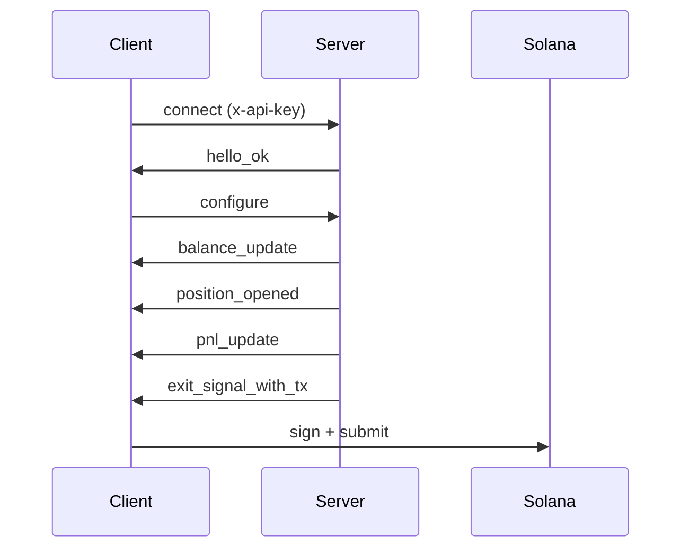

## Exit Intelligence Stream이란?

Exit Intelligence Stream은 온체인에서 지갑을 모니터링하고, 토큰 포지션을 추적하며, 실시간으로 손익 전략을 평가하고, 임계값이 충족되면 사전 구축된 서명되지 않은 청산 트랜잭션을 전달하는 지속적인 WebSocket 연결입니다.

**Professional 및 Advanced 티어** 구독자는 슬리피지 밴드와 유동성 추세 데이터가 포함된 실시간 [유동성 스냅샷](/api/stream/server-events#liquidity_snapshot)도 받아, 주어진 가격 영향에서 포지션을 얼마나 매도할 수 있는지, 풀 유동성이 증가, 안정 또는 감소하고 있는지를 볼 수 있습니다. 자세한 내용은 [전체 공지](https://www.lasersell.io/blog/liquidity-snapshots-and-sdk-0-3)를 참조하세요.

## 엔드포인트

```
wss://stream.lasersell.io/v1/ws
```

인증은 `x-api-key` 헤더를 통해 처리되며, SDK가 자동으로 설정합니다.

## Exit Intelligence Stream vs REST 사용 시기

| 시나리오                                     | 사용                          |
|----------------------------------------------|------------------------------|
| 수익/손실 목표 도달 시 자동 매도 | Exit Intelligence Stream     |
| 일회성 매수 또는 매도 트랜잭션               | REST (LaserSell API)         |
| 지속적인 포지션 모니터링                | Exit Intelligence Stream     |
| 사용자 확인을 위한 트랜잭션 빌드  | REST (LaserSell API)         |
| 지갑 활동에 반응하는 봇            | Exit Intelligence Stream     |

서버가 포지션을 감시하고 자동으로 청산 트랜잭션을 전달하기를 원하면 **Exit Intelligence Stream**을 사용하세요. 요청 시 단일 트랜잭션이 필요하면 **REST API**를 사용하세요.

<Warning>
**매수 전에 스트림을 연결하세요.** Exit Intelligence Stream은 온체인 토큰 도착을 관찰하여 새 포지션을 감지합니다. 스트림이 연결 및 구성되기 전에 `/v1/buy`를 호출하면 포지션이 추적되지 않으며 청산 신호가 발동하지 않습니다. 항상 스트림을 먼저 연결하고 구성한 다음 매수를 제출하세요.
</Warning>

## 상위 수준 흐름

1. API 키로 `wss://stream.lasersell.io/v1/ws`에 **연결**합니다.
2. 서버에서 `hello_ok`를 받습니다 (세션 ID 및 속도 제한 포함).
3. 지갑 공개키와 전략 매개변수로 **`configure`를 전송**합니다.
4. 기존 토큰 보유에 대한 초기 `balance_update` 메시지를 받습니다.
5. **스트림이 모니터링**하여 새 토큰 도착을 감시하고 손익을 추적합니다.
6. 포지션이 목표 수익, 손절매, 트레일링 스탑 또는 데드라인에 도달하면 서버가 `exit_signal_with_tx`를 보냅니다.
7. **로컬에서 서명**하고 서명되지 않은 트랜잭션을 제출합니다.



## SDK 진입점

SDK는 두 가지 추상화 수준을 제공합니다:

- **`StreamClient`**: 저수준 클라이언트. WebSocket 연결, 재연결, 메시지 프레이밍을 관리합니다. 원시 `ServerMessage` 객체를 반환합니다.
- **`StreamSession`**: 고수준 래퍼. `StreamClient`를 포지션 추적, 데드라인 타이머, 유동성 스냅샷 캐싱, `PositionHandle`을 포함한 타입 `StreamEvent` 객체로 감쌉니다.

대부분의 사용 사례에서 `StreamSession`으로 시작하세요.

<CodeGroup>
```typescript TypeScript
import { StreamClient, StreamSession } from "@lasersell/lasersell-sdk";

const client = new StreamClient("YOUR_API_KEY");
const session = await StreamSession.connect(client, {
  wallet_pubkeys: ["WALLET_PUBKEY"],
  strategy: { target_profit_pct: 5, stop_loss_pct: 1.5 },
  deadline_timeout_sec: 45,
  send_mode: "helius_sender",
  tip_lamports: 1000,
});

while (true) {
  const event = await session.recv();
  if (event === null) break;
  // Handle event...
}
```

```python Python
from lasersell_sdk.stream.client import StreamClient, StreamConfigure
from lasersell_sdk.stream.session import StreamSession

client = StreamClient("YOUR_API_KEY")
session = await StreamSession.connect(
    client,
    StreamConfigure(
        wallet_pubkeys=["WALLET_PUBKEY"],
        strategy={"target_profit_pct": 5.0, "stop_loss_pct": 1.5},
        deadline_timeout_sec=45,
    ),
)

while True:
    event = await session.recv()
    if event is None:
        break
    # Handle event...
```

```rust Rust
use lasersell_sdk::stream::client::{StreamClient, StreamConfigure};
use lasersell_sdk::stream::session::StreamSession;
use lasersell_sdk::stream::proto::StrategyConfigMsg;
use secrecy::SecretString;

let client = StreamClient::new(SecretString::new(std::env::var("LASERSELL_API_KEY")?));
let session = StreamSession::connect(&client, StreamConfigure {
    wallet_pubkeys: vec!["WALLET_PUBKEY".into()],
    strategy: StrategyConfigMsg {
        target_profit_pct: 5.0,
        stop_loss_pct: 1.5,
        ..Default::default()
    },
    deadline_timeout_sec: Some(45),
}).await?;

loop {
    let event = match session.recv().await {
        Some(event) => event,
        None => break,
    };
    // Handle event...
}
```

```go Go
import "github.com/lasersell/lasersell-sdk/go/stream"

client := stream.NewStreamClient("YOUR_API_KEY")
session, err := stream.ConnectSession(ctx, client, stream.StreamConfigure{
    WalletPubkeys: []string{"WALLET_PUBKEY"},
    Strategy: stream.StrategyConfigMsg{
        TargetProfitPct: 5.0,
        StopLossPct:     1.5,
    },
    DeadlineTimeoutSec: 45,
})
if err != nil {
    log.Fatal(err)
}

for {
    event, err := session.Recv(ctx)
    if errors.Is(err, io.EOF) {
        break
    }
    // Handle event...
}
```
</CodeGroup>

## 다음 단계

- [연결 수명 주기](/api/stream/connection-lifecycle): 상세한 핸드셰이크, 재연결, 레인 분리.
- [전략 구성](/api/stream/strategy-configuration): 수익 목표, 손절매, 트레일링 스탑 구성.
- [서버 이벤트](/api/stream/server-events): 유동성 스냅샷을 포함한 9개 서버 메시지 타입의 전체 스키마.
- [클라이언트 메시지](/api/stream/client-messages): 6개 클라이언트 메시지 타입과 스키마.
