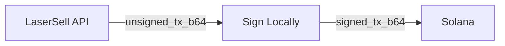

전체 트랜잭션 서명 참조는 영문 문서 [Transaction Signing](/api/transactions/signing)을 참조하세요. 모든 코드 블록과 SDK 예제는 영문 원본과 동일합니다.

## 비수탁형 흐름

LaserSell은 개인키에 절대 접근하지 않습니다. 모든 트랜잭션은 다음 패턴을 따릅니다:

1. **빌드**: API가 base64로 인코딩된 서명되지 않은 `VersionedTransaction`을 반환합니다.
2. **서명**: 키페어를 사용하여 로컬에서 디코딩, 서명, 재인코딩합니다.
3. **제출**: 서명된 트랜잭션을 [전송 대상](/api/transactions/send-targets)을 통해 Solana 네트워크에 전송합니다.

전체 키페어 로딩 코드, 서명 함수 (표준 서명, 빠른 서명, 서명+전송 일괄), 제출 코드, 오류 타입, 보안 모범 사례는 영문 원본 문서를 참조하세요.
