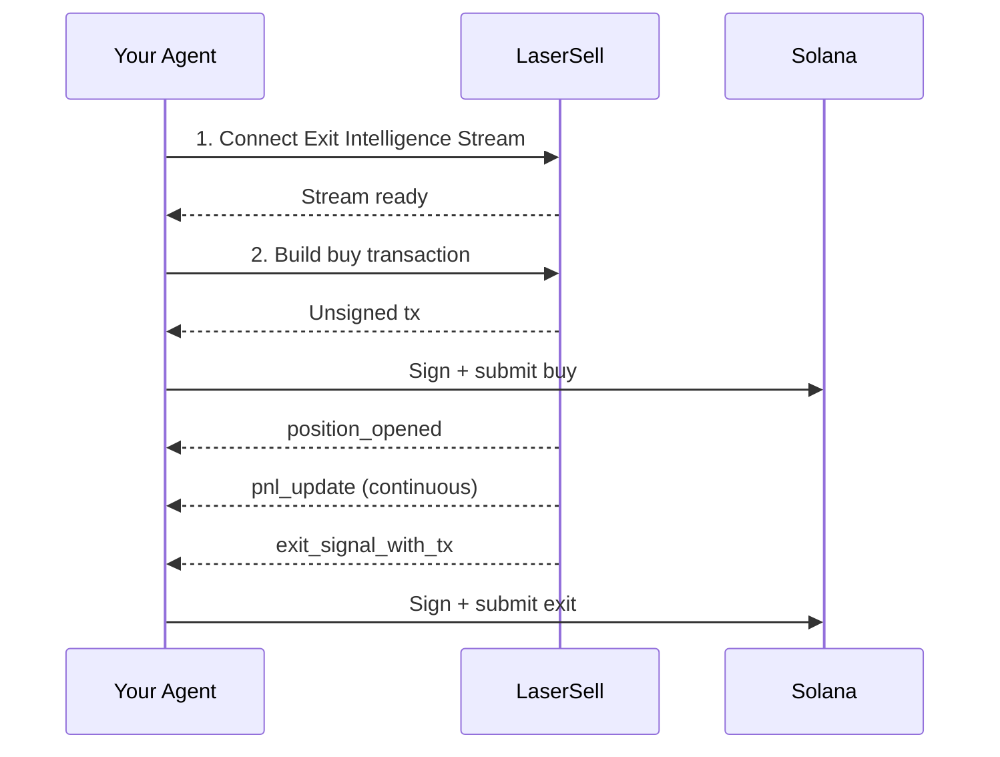

Это руководство проведёт вас через создание ИИ агента, который может автономно торговать токенами Solana, используя LaserSell как уровень исполнения. Агент отвечает за принятие решений (когда покупать, какую стратегию использовать), а LaserSell берёт на себя всё остальное: маршрутизацию протоколов, мониторинг позиций, отслеживание PnL и автоматическое исполнение выходов.

Этот паттерн работает независимо от того, как построен ваш агент. Расширяете ли вы персонального ИИ ассистента вроде [OpenClaw](https://openclaw.ai/) торговыми навыками, строите автономного торгового бота, интегрируете в фреймворк Telegram бота или подключаете агента, построенного с LangChain, CrewAI или любым другим фреймворком, интеграция с LaserSell одинакова. Ваш агент вызывает API, подключается к потоку и подписывает транзакции. Остальное за вами.

## Что будет делать агент

1. **Подключаться** к Exit Intelligence Stream для начала мониторинга.
2. **Покупать** токен, создавая и отправляя транзакцию через REST API.
3. **Мониторить** позицию автоматически через поток (обновления PnL, отслеживание цены).
4. **Выходить** при выполнении условий стратегии (тейк профит, стоп лосс, трейлинг стоп или дедлайн).

Агенту не нужно знать, на каком DEX или лаунчпаде находится токен. LaserSell разрешает протокол, строит транзакцию и доставляет сигналы выхода в реальном времени.

## Предварительные требования

- API ключ LaserSell ([получите здесь](https://app.lasersell.io)).
- Keypair Solana (файл JSON с байтовым массивом).
- Python 3.10+ с установленным LaserSell SDK.

```bash
pip install lasersell-sdk[tx,stream]
```

Примеры ниже используют Python, но тот же поток применим с SDK на [TypeScript](/api/sdk/typescript), [Rust](/api/sdk/rust) или [Go](/api/sdk/go).

## Архитектура



Ваш агент принимает решения. LaserSell отвечает за исполнение. Граница между ними чёткая: агент отправляет запросы и получает события. Все транзакции неподписанные и подписываются локально агентом.

## Шаг 1: Подключение Exit Intelligence Stream

Поток должен быть подключён **до** покупки. Поток обнаруживает позиции, наблюдая за поступлениями токенов в блокчейне в реальном времени. Если покупка совершится до подключения потока, позиция не будет отслеживаться.

```python
import asyncio
import json
import os
from pathlib import Path
from solders.keypair import Keypair
from lasersell_sdk.stream.client import StreamClient, StreamConfigure
from lasersell_sdk.stream.session import StreamSession

api_key = os.environ["LASERSELL_API_KEY"]
keypair_bytes = json.loads(Path("./keypair.json").read_text())
signer = Keypair.from_bytes(bytes(keypair_bytes))
wallet_pubkey = str(signer.pubkey())

# Connect and configure the stream
stream_client = StreamClient(api_key)
session = await StreamSession.connect(
    stream_client,
    StreamConfigure(
        wallet_pubkeys=[wallet_pubkey],
        strategy={
            "target_profit_pct": 10.0,
            "stop_loss_pct": 5.0,
            "trailing_stop_pct": 3.0,
            "sell_on_graduation": True,
        },
        deadline_timeout_sec=120,
        send_mode="helius_sender",
        tip_lamports=1000,
    ),
)
```

Конфигурация стратегии указывает LaserSell, когда генерировать сигналы выхода:

| Параметр | Значение | Значение |
|-----------|-------|---------|
| `target_profit_pct` | `10.0` | Продавать при достижении 10% прибыли. |
| `stop_loss_pct` | `5.0` | Продавать при достижении 5% убытка. |
| `trailing_stop_pct` | `3.0` | Продавать при падении прибыли на 3% от пика. |
| `sell_on_graduation` | `true` | Продавать при миграции токена с бондинг-кривой на AMM. |
| `deadline_timeout_sec` | `120` | Принудительная продажа через 120 секунд, если не сработало другое условие. |

Ваш агент может корректировать эти параметры динамически на основе собственной логики. См. [Конфигурация стратегии](/api/stream/strategy-configuration).

## Шаг 2: Создание и отправка покупки

После подключения потока агент может купить токен. REST API строит неподписанную транзакцию, которую агент подписывает локально и отправляет.

```python
from lasersell_sdk.exit_api import ExitApiClient, BuildBuyTxRequest
from lasersell_sdk.tx import SendTargetHeliusSender, send_transaction, sign_unsigned_tx

api_client = ExitApiClient.with_api_key(api_key)

# Build the unsigned buy transaction
buy_request = BuildBuyTxRequest(
    mint="TOKEN_MINT_ADDRESS",
    user_pubkey=wallet_pubkey,
    amount=0.1,  # 0.1 SOL
    slippage_bps=2_000,              # 20% slippage tolerance
)
response = await api_client.build_buy_tx(buy_request)

# Sign locally and submit
signed_tx = sign_unsigned_tx(response.tx, signer)
signature = await send_transaction(SendTargetHeliusSender(), signed_tx)
print(f"Buy submitted: {signature}")
```

Агент никогда не отправляет свой приватный ключ куда-либо. LaserSell возвращает неподписанную транзакцию, агент подписывает её локально и отправляет непосредственно в сеть Solana через Helius Sender.

## Шаг 3: Мониторинг и автоматический выход

После того как покупка попадает в блокчейн, Exit Intelligence Stream обнаруживает новый баланс токена и начинает отслеживать позицию. Агент слушает события и действует по сигналам выхода.

```python
from lasersell_sdk.tx import SendTargetHeliusSender, send_transaction, sign_unsigned_tx

while True:
    event = await session.recv()
    if event is None:
        break  # Stream disconnected

    if event.type == "position_opened":
        handle = event.handle
        print(f"Position opened: {handle.mint}")
        print(f"  Token account: {handle.token_account}")

    elif event.type == "pnl_update":
        msg = event.message
        pnl_pct = msg["pnl_pct"]
        print(f"PnL update: {pnl_pct:.2f}%")

    elif event.type == "exit_signal_with_tx":
        msg = event.message  # TypedDict, use dict access
        reason = msg["reason"]
        print(f"Exit signal fired: {reason}")

        # Sign and submit the pre-built exit transaction
        signed_tx = sign_unsigned_tx(str(msg["unsigned_tx_b64"]), signer)
        sig = await send_transaction(SendTargetHeliusSender(), signed_tx)
        print(f"Exit submitted: {sig}")

    elif event.type == "position_closed":
        msg = event.message
        print(f"Position closed: {msg['reason']}")
```

Ключевые события:

| Событие | Что означает |
|-------|---------------|
| `position_opened` | Новый токен поступил в кошелёк. Отслеживание началось. |
| `pnl_update` | Периодический снимок прибыли/убытка для позиции. |
| `exit_signal_with_tx` | Условие стратегии выполнено. Содержит предварительно построенную неподписанную транзакцию выхода, готовую к подписи и отправке. |
| `position_closed` | Позиция больше не отслеживается (продана, переведена или закрыта вручную). |

## Шаг 4: Обновление стратегии во время сессии

Ваш агент может корректировать параметры стратегии в любое время на основе собственной логики. Например, ужесточить трейлинг стоп после того, как позиция стала прибыльной, или отключить дедлайн, если агент решает держать дольше.

```python
# Tighten trailing stop after detecting strong momentum
session.sender().update_strategy({
    "target_profit_pct": 15.0,
    "stop_loss_pct": 3.0,
    "trailing_stop_pct": 2.0,
})
```

Обновление вступает в силу немедленно для всех отслеживаемых позиций. Переподключение не требуется.

## Полный рабочий пример

Вот полный цикл агента, объединяющий все шаги:

```python
import asyncio
import json
import os
from pathlib import Path
from solders.keypair import Keypair
from lasersell_sdk.exit_api import ExitApiClient, BuildBuyTxRequest
from lasersell_sdk.stream.client import StreamClient, StreamConfigure
from lasersell_sdk.stream.session import StreamSession
from lasersell_sdk.tx import SendTargetHeliusSender, send_transaction, sign_unsigned_tx


async def run_agent(mint: str, amount_sol: float):
    api_key = os.environ["LASERSELL_API_KEY"]
    signer = Keypair.from_bytes(
        bytes(json.loads(Path("./keypair.json").read_text()))
    )
    wallet_pubkey = str(signer.pubkey())

    # --- 1. Connect the Exit Intelligence Stream ---
    stream_client = StreamClient(api_key)
    session = await StreamSession.connect(
        stream_client,
        StreamConfigure(
            wallet_pubkeys=[wallet_pubkey],
            strategy={
                "target_profit_pct": 10.0,
                "stop_loss_pct": 5.0,
                "trailing_stop_pct": 3.0,
                "sell_on_graduation": True,
            },
            deadline_timeout_sec=120,
        ),
    )

    # --- 2. Build and submit the buy ---
    api_client = ExitApiClient.with_api_key(api_key)
    buy_request = BuildBuyTxRequest(
        mint=mint,
        user_pubkey=wallet_pubkey,
        amount=amount_sol,
        slippage_bps=2_000,
    )
    response = await api_client.build_buy_tx(buy_request)
    signed_tx = sign_unsigned_tx(response.tx, signer)
    buy_sig = await send_transaction(SendTargetHeliusSender(), signed_tx)
    print(f"Buy submitted: {buy_sig}")

    # --- 3. Listen for events and handle exits ---
    while True:
        event = await session.recv()
        if event is None:
            print("Stream disconnected")
            break

        if event.type == "position_opened":
            print(f"Tracking position: {event.handle.mint}")

        elif event.type == "exit_signal_with_tx":
            msg = event.message
            print(f"Exit signal: {msg['reason']}")
            signed_tx = sign_unsigned_tx(str(msg["unsigned_tx_b64"]), signer)
            sig = await send_transaction(SendTargetHeliusSender(), signed_tx)
            print(f"Exit submitted: {sig}")
            break  # Position exited, agent is done

        elif event.type == "position_closed":
            print(f"Position closed: {event.message['reason']}")
            break


asyncio.run(run_agent(
    mint="TOKEN_MINT_ADDRESS",
    amount_sol=0.1,  # 0.1 SOL
))
```

## Расширение этого паттерна

Это руководство показывает один цикл покупки и выхода. Продакшен-агент будет строиться на этой основе:

**Интеграция сигналов.** Агент получает сигналы на покупку из любого источника: пользовательские запросы, анализ в блокчейне, социальные ленты, лидеры копи-трейдинга или другая модель ИИ. Сигнал определяет, когда вызывать `build_buy_tx`.

**Управление множеством позиций.** Поток отслеживает несколько позиций одновременно по одному или нескольким кошелькам. Агент может управлять портфелем активных позиций, каждая со своей логикой входа, в то время как LaserSell оценивает условия выхода для всех них параллельно.

**Динамическая стратегия.** Используйте `update_strategy` для корректировки параметров в зависимости от рыночных условий, производительности позиции или уверенности агента. Агент, обнаруживший высокую волатильность, может ужесточить стопы. Агент, обнаруживший сильный тренд, может их расширить.

**Контроль рисков.** Реализуйте размер позиции, максимальное количество одновременных позиций, дневные лимиты убытков или любые другие правила управления рисками в слое принятия решений вашего агента перед вызовом API.

**Интеграция MCP.** Если ваш агент работает внутри MCP-совместимого клиента, такого как [OpenClaw](https://openclaw.ai/), Claude, Cursor или другого ИИ ассистента, он может использовать [MCP сервер LaserSell](/ai-agents/mcp-server) для поиска документации, схем API и примеров кода в реальном времени при создании или отладке интеграции.

## Следующие шаги

- [Обзор API](/api/overview) для полного описания API.
- [Exit Intelligence Stream](/api/stream/overview) для детального обзора протокола потока.
- [Конфигурация стратегии](/api/stream/strategy-configuration) для всех параметров стратегии.
- [Подпись транзакций](/api/transactions/signing) для деталей подписи и отправки.
- [MCP сервер](/ai-agents/mcp-server) для предоставления вашему ИИ агенту доступа к документации LaserSell.
