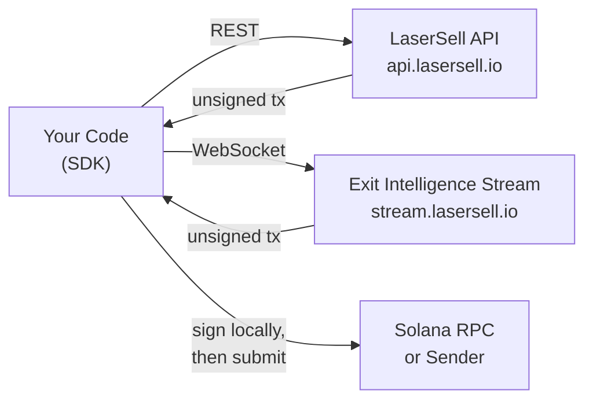

## Что такое LaserSell API?

LaserSell API позволяет программно строить, подписывать и отправлять транзакции обмена на Solana. Он предоставляет два интерфейса:

- **LaserSell API** (REST): построение неподписанных транзакций покупки и продажи по запросу через `POST /v1/sell` и `POST /v1/buy`. Получение данных аккаунта через `GET /v1/account` и запрос истории сделок через `GET /v1/history`.
- **Exit Intelligence Stream** (WebSocket): постоянная сессия, которая наблюдает за вашими кошельками, отслеживает позиции, оценивает вашу стратегию в реальном времени и доставляет предварительно построенные транзакции выхода при достижении пороговых значений.

Оба интерфейса возвращают **неподписанные транзакции**. Ваш приватный ключ никогда не покидает ваше устройство. Вы подписываете локально, затем отправляете через цель отправки по вашему выбору.

## Некастодиальная модель

LaserSell полностью некастодиален. Сервер создаёт оптимизированные инструкции обмена, но не может выполнить их без вашей подписи. Это означает:

1. Вы держите пару ключей всё время.
2. API возвращает закодированную в base64 неподписанную транзакцию.
3. Вы подписываете своей локальной парой ключей.
4. Вы отправляете через RPC, Helius Sender или Astralane.

Никакие средства, токены или ключи никогда не хранятся и не доступны инфраструктуре LaserSell.

## Обзор архитектуры

## Языки SDK

Официальные SDK доступны на четырёх языках, каждый предоставляет одинаковые возможности:

| Язык   | Пакет                          | Модули                                        |
|------------|----------------------------------|-------------------------------------------------|
| TypeScript | `@lasersell/lasersell-sdk`       | `ExitApiClient`, `StreamClient`, `StreamSession`, tx helpers |
| Python     | `lasersell-sdk`                  | `ExitApiClient`, `StreamClient`, `StreamSession`, tx helpers |
| Rust       | `lasersell-sdk`                  | `exit_api`, `stream`, `tx`                      |
| Go         | `github.com/lasersell/lasersell-sdk/go` | `ExitAPIClient`, `stream.StreamClient`, `stream.StreamSession`, tx helpers |

Все SDK используют одинаковые схемы запросов и ответов, типы ошибок и поведение повторных попыток. Выберите язык, подходящий вашему стеку, и следуйте соответствующему руководству SDK.

## Что читать дальше

- [Аутентификация](/api/authentication): получите API ключ и начните делать запросы.
- [Быстрый старт](/api/quickstart): создайте свою первую транзакцию продажи менее чем за пять минут.
- [Exit Intelligence Stream](/api/stream/overview): узнайте, когда использовать WebSocket поток вместо REST.
