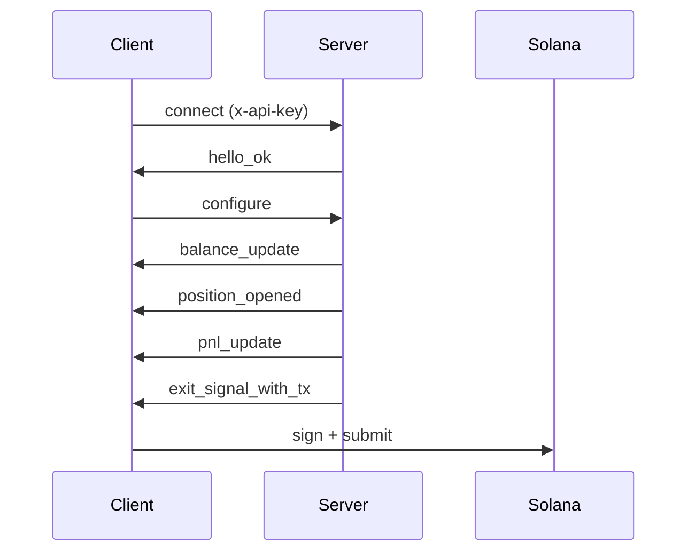

## Что такое Exit Intelligence Stream?

Exit Intelligence Stream — это постоянное WebSocket-соединение, которое мониторит ваши кошельки в блокчейне, отслеживает позиции по токенам, оценивает вашу стратегию прибыли и убытков в реальном времени и доставляет предварительно построенные неподписанные транзакции выхода при достижении пороговых значений.

Подписчики тарифов **Professional и Advanced** также получают [снимки ликвидности](/api/stream/server-events#liquidity_snapshot) в реальном времени с полосами проскальзывания и данными о тренде ликвидности, предоставляя видимость того, какую часть позиции можно продать при заданном ценовом воздействии и растёт ли ликвидность пула, стабильна или убывает. Подробности в [полном объявлении](https://www.lasersell.io/blog/liquidity-snapshots-and-sdk-0-3).

## Эндпоинт

```
wss://stream.lasersell.io/v1/ws
```

Аутентификация выполняется через заголовок `x-api-key`, который SDK устанавливают автоматически.

## Когда использовать Exit Intelligence Stream vs REST

| Сценарий | Использовать |
|----------------------------------------------|------------------------------|
| Автоматическая продажа при достижении целевой прибыли/убытка | Exit Intelligence Stream |
| Разовая транзакция покупки или продажи | REST (LaserSell API) |
| Непрерывный мониторинг позиций | Exit Intelligence Stream |
| Построение транзакции для подтверждения пользователем | REST (LaserSell API) |
| Бот, реагирующий на активность кошелька | Exit Intelligence Stream |

Используйте **Exit Intelligence Stream**, когда хотите, чтобы сервер наблюдал за вашими позициями и автоматически доставлял транзакции выхода. Используйте **REST API**, когда нужна одна транзакция, построенная по запросу.

<Warning>
**Подключите поток перед покупкой.** Exit Intelligence Stream обнаруживает новые позиции, наблюдая за поступлениями токенов в блокчейне. Если вы вызовете `/v1/buy` до подключения и конфигурации потока, позиция не будет отслеживаться и сигналы выхода не сработают. Всегда подключайте и настраивайте поток первым, затем отправляйте покупку.
</Warning>

## Общий поток

1. **Подключение** к `wss://stream.lasersell.io/v1/ws` с вашим API ключом.
2. Получение `hello_ok` от сервера (содержит ID сессии и лимиты).
3. **Отправка `configure`** с публичными ключами кошельков и параметрами стратегии.
4. Получение начальных сообщений `balance_update` для существующих токен-активов.
5. **Поток мониторит** ваши кошельки для обнаружения новых поступлений токенов и отслеживает прибыль и убыток.
6. Когда позиция достигает тейк профита, стоп лосса, трейлинг стопа или дедлайна, сервер отправляет `exit_signal_with_tx`.
7. **Подпишите локально** и отправьте неподписанную транзакцию.



## Точки входа SDK

SDK предоставляют два уровня абстракции:

- **`StreamClient`**: низкоуровневый клиент. Управляет WebSocket-соединением, переподключением и кадрированием сообщений. Возвращает необработанные объекты `ServerMessage`.
- **`StreamSession`**: высокоуровневая обёртка. Обёртывает `StreamClient` с отслеживанием позиций, таймерами дедлайнов, кешированием снимков ликвидности и типизированными объектами `StreamEvent`, включающими `PositionHandle`.

Для большинства случаев начните с `StreamSession`.

<CodeGroup>
```typescript TypeScript
import { StreamClient, StreamSession } from "@lasersell/lasersell-sdk";

const client = new StreamClient("YOUR_API_KEY");
const session = await StreamSession.connect(client, {
  wallet_pubkeys: ["WALLET_PUBKEY"],
  strategy: { target_profit_pct: 5, stop_loss_pct: 1.5 },
  deadline_timeout_sec: 45,
  send_mode: "helius_sender",
  tip_lamports: 1000,
});

while (true) {
  const event = await session.recv();
  if (event === null) break;
  // Handle event...
}
```

```python Python
from lasersell_sdk.stream.client import StreamClient, StreamConfigure
from lasersell_sdk.stream.session import StreamSession

client = StreamClient("YOUR_API_KEY")
session = await StreamSession.connect(
    client,
    StreamConfigure(
        wallet_pubkeys=["WALLET_PUBKEY"],
        strategy={"target_profit_pct": 5.0, "stop_loss_pct": 1.5},
        deadline_timeout_sec=45,
    ),
)

while True:
    event = await session.recv()
    if event is None:
        break
    # Handle event...
```

```rust Rust
use lasersell_sdk::stream::client::{StreamClient, StreamConfigure};
use lasersell_sdk::stream::session::StreamSession;
use lasersell_sdk::stream::proto::StrategyConfigMsg;
use secrecy::SecretString;

let client = StreamClient::new(SecretString::new(std::env::var("LASERSELL_API_KEY")?));
let session = StreamSession::connect(&client, StreamConfigure {
    wallet_pubkeys: vec!["WALLET_PUBKEY".into()],
    strategy: StrategyConfigMsg {
        target_profit_pct: 5.0,
        stop_loss_pct: 1.5,
        ..Default::default()
    },
    deadline_timeout_sec: Some(45),
}).await?;

loop {
    let event = match session.recv().await {
        Some(event) => event,
        None => break,
    };
    // Handle event...
}
```

```go Go
import "github.com/lasersell/lasersell-sdk/go/stream"

client := stream.NewStreamClient("YOUR_API_KEY")
session, err := stream.ConnectSession(ctx, client, stream.StreamConfigure{
    WalletPubkeys: []string{"WALLET_PUBKEY"},
    Strategy: stream.StrategyConfigMsg{
        TargetProfitPct: 5.0,
        StopLossPct:     1.5,
    },
    DeadlineTimeoutSec: 45,
})
if err != nil {
    log.Fatal(err)
}

for {
    event, err := session.Recv(ctx)
    if errors.Is(err, io.EOF) {
        break
    }
    // Handle event...
}
```
</CodeGroup>

## Следующие шаги

- [Жизненный цикл соединения](/api/stream/connection-lifecycle): детали рукопожатия, переподключения и разделения каналов.
- [Конфигурация стратегии](/api/stream/strategy-configuration): настройка целей прибыли, стоп лоссов и трейлинг стопов.
- [Серверные события](/api/stream/server-events): полная схема всех 9 типов серверных сообщений, включая снимки ликвидности.
- [Клиентские сообщения](/api/stream/client-messages): все 6 типов клиентских сообщений и их схемы.
