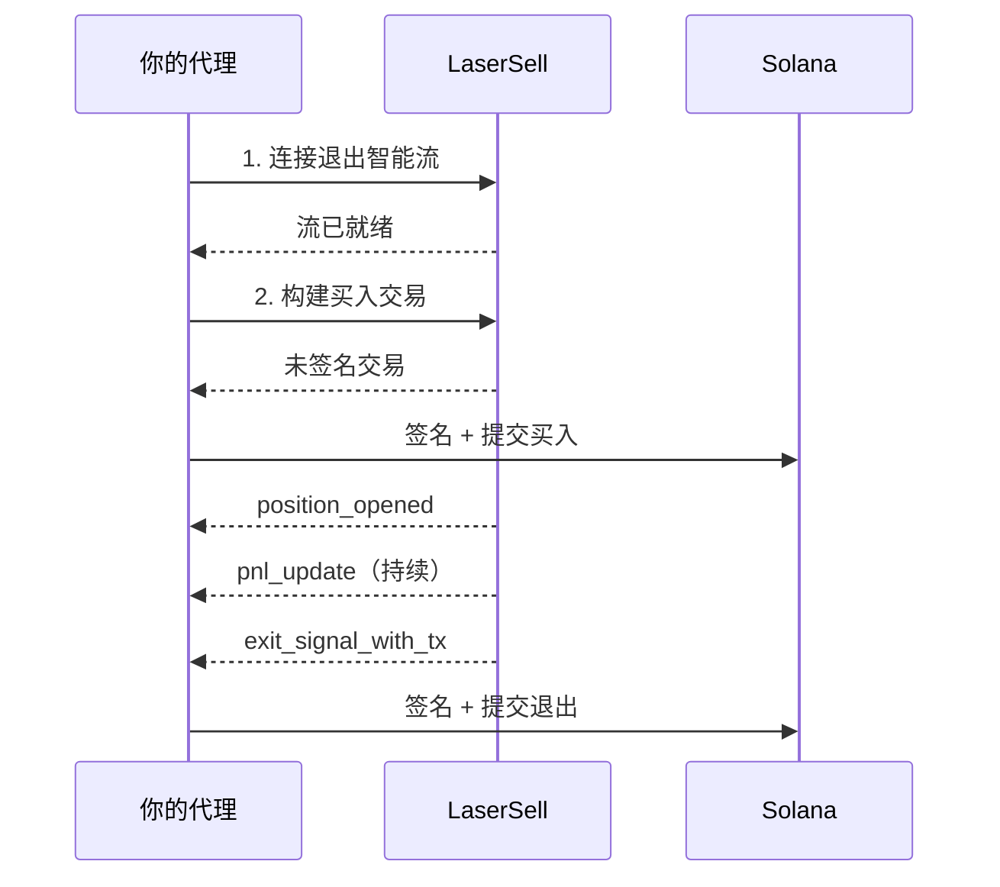

本指南介绍如何构建一个能够使用 LaserSell 作为执行层自主交易 Solana 代币的 AI 代理。代理处理决策（何时买入、使用什么策略），LaserSell 处理其余一切：协议路由、仓位监控、盈亏追踪和自动退出执行。

无论你的代理是如何构建的，这个模式都适用。无论你是使用交易技能扩展像 [OpenClaw](https://openclaw.ai/) 这样的个人 AI 助手，还是构建独立的交易机器人，集成到 Telegram 机器人框架中，或者使用 LangChain、CrewAI 或任何其他框架构建代理，LaserSell 集成方式都是一样的。你的代理调用 API，连接流，签名交易。其余由你决定。

## 代理将执行的操作

1. **连接**退出智能流以开始监控。
2. **买入**代币，通过 REST API 构建并提交交易。
3. **监控**仓位，通过流自动完成（盈亏更新、价格追踪）。
4. **退出**，当策略条件满足时（目标利润、止损、追踪止损或截止时间）。

代理不需要知道代币在哪个 DEX 或发射台上。LaserSell 解析协议，构建交易，并实时发送退出信号。

## 前提条件

- 一个 LaserSell API 密钥（[在此获取](https://app.lasersell.io)）。
- 一个 Solana 密钥对（JSON 字节数组文件）。
- Python 3.10+ 并安装 LaserSell SDK。

```bash
pip install lasersell-sdk[tx,stream]
```

以下示例使用 Python，但相同的流程适用于 [TypeScript](/api/sdk/typescript)、[Rust](/api/sdk/rust) 或 [Go](/api/sdk/go) SDK。

## 架构



你的代理掌握决策。LaserSell 掌握执行。两者之间的边界清晰：代理发送请求并接收事件。所有交易都是未签名的，由代理在本地签名。

## 步骤 1：连接退出智能流

流必须在代理买入**之前**连接。流通过实时观察链上代币到达来检测仓位。如果买入在流连接之前落地，仓位将不会被追踪。

```python
import asyncio
import json
import os
from pathlib import Path
from solders.keypair import Keypair
from lasersell_sdk.stream.client import StreamClient, StreamConfigure
from lasersell_sdk.stream.session import StreamSession

api_key = os.environ["LASERSELL_API_KEY"]
keypair_bytes = json.loads(Path("./keypair.json").read_text())
signer = Keypair.from_bytes(bytes(keypair_bytes))
wallet_pubkey = str(signer.pubkey())

# 连接和配置流
stream_client = StreamClient(api_key)
session = await StreamSession.connect(
    stream_client,
    StreamConfigure(
        wallet_pubkeys=[wallet_pubkey],
        strategy={
            "target_profit_pct": 10.0,
            "stop_loss_pct": 5.0,
            "trailing_stop_pct": 3.0,
            "sell_on_graduation": True,
        },
        deadline_timeout_sec=120,
        send_mode="helius_sender",
        tip_lamports=1000,
    ),
)
```

策略配置告诉 LaserSell 何时生成退出信号：

| 参数 | 值 | 含义 |
|-----------|-------|---------|
| `target_profit_pct` | `10.0` | 利润达到 10% 时卖出。 |
| `stop_loss_pct` | `5.0` | 亏损达到 5% 时卖出。 |
| `trailing_stop_pct` | `3.0` | 利润从峰值下降 3% 时卖出。 |
| `sell_on_graduation` | `true` | 代币从联合曲线迁移到 AMM 时卖出。 |
| `deadline_timeout_sec` | `120` | 如果 120 秒内没有其他条件触发，强制卖出。 |

你的代理可以根据自己的逻辑动态调整这些参数。参见[策略配置](/api/stream/strategy-configuration)。

## 步骤 2：构建并提交买入

流连接后，代理可以买入代币。REST API 构建一个未签名的交易，代理在本地签名并提交。

```python
from lasersell_sdk.exit_api import ExitApiClient, BuildBuyTxRequest
from lasersell_sdk.tx import SendTargetHeliusSender, send_transaction, sign_unsigned_tx

api_client = ExitApiClient.with_api_key(api_key)

# 构建未签名的买入交易
buy_request = BuildBuyTxRequest(
    mint="TOKEN_MINT_ADDRESS",
    user_pubkey=wallet_pubkey,
    amount=0.1,  # 0.1 SOL
    slippage_bps=2_000,              # 20% 滑点容忍度
)
response = await api_client.build_buy_tx(buy_request)

# 本地签名并提交
signed_tx = sign_unsigned_tx(response.tx, signer)
signature = await send_transaction(SendTargetHeliusSender(), signed_tx)
print(f"Buy submitted: {signature}")
```

代理永远不会将私钥发送到任何地方。LaserSell 返回未签名的交易，代理在本地签名，并通过 Helius Sender 直接提交到 Solana 网络。

## 步骤 3：自动监控和退出

买入在链上落地后，退出智能流检测到新的代币余额并开始追踪仓位。代理监听事件并对退出信号采取行动。

```python
from lasersell_sdk.tx import SendTargetHeliusSender, send_transaction, sign_unsigned_tx

while True:
    event = await session.recv()
    if event is None:
        break  # 流断开

    if event.type == "position_opened":
        handle = event.handle
        print(f"Position opened: {handle.mint}")
        print(f"  Token account: {handle.token_account}")

    elif event.type == "pnl_update":
        msg = event.message
        pnl_pct = msg["pnl_pct"]
        print(f"PnL update: {pnl_pct:.2f}%")

    elif event.type == "exit_signal_with_tx":
        msg = event.message  # TypedDict，使用字典访问
        reason = msg["reason"]
        print(f"Exit signal fired: {reason}")

        # 签名并提交预构建的退出交易
        signed_tx = sign_unsigned_tx(str(msg["unsigned_tx_b64"]), signer)
        sig = await send_transaction(SendTargetHeliusSender(), signed_tx)
        print(f"Exit submitted: {sig}")

    elif event.type == "position_closed":
        msg = event.message
        print(f"Position closed: {msg['reason']}")
```

关键事件：

| 事件 | 含义 |
|-------|---------------|
| `position_opened` | 钱包中到达新代币。追踪已开始。 |
| `pnl_update` | 仓位的定期利润/亏损快照。 |
| `exit_signal_with_tx` | 策略条件已满足。包含预构建的未签名退出交易，可直接签名并提交。 |
| `position_closed` | 仓位不再被追踪（已卖出、已转移或手动关闭）。 |

## 步骤 4：会话中更新策略

你的代理可以根据自己的逻辑随时调整策略参数。例如，在仓位盈利后收紧追踪止损，或在代理决定持有更长时间时禁用截止时间。

```python
# 检测到强劲动量后收紧追踪止损
session.sender().update_strategy({
    "target_profit_pct": 15.0,
    "stop_loss_pct": 3.0,
    "trailing_stop_pct": 2.0,
})
```

更新对所有被追踪的仓位立即生效。无需重新连接。

## 完整工作示例

以下是组合所有步骤的完整代理循环：

```python
import asyncio
import json
import os
from pathlib import Path
from solders.keypair import Keypair
from lasersell_sdk.exit_api import ExitApiClient, BuildBuyTxRequest
from lasersell_sdk.stream.client import StreamClient, StreamConfigure
from lasersell_sdk.stream.session import StreamSession
from lasersell_sdk.tx import SendTargetHeliusSender, send_transaction, sign_unsigned_tx


async def run_agent(mint: str, amount_sol: float):
    api_key = os.environ["LASERSELL_API_KEY"]
    signer = Keypair.from_bytes(
        bytes(json.loads(Path("./keypair.json").read_text()))
    )
    wallet_pubkey = str(signer.pubkey())

    # --- 1. 连接退出智能流 ---
    stream_client = StreamClient(api_key)
    session = await StreamSession.connect(
        stream_client,
        StreamConfigure(
            wallet_pubkeys=[wallet_pubkey],
            strategy={
                "target_profit_pct": 10.0,
                "stop_loss_pct": 5.0,
                "trailing_stop_pct": 3.0,
                "sell_on_graduation": True,
            },
            deadline_timeout_sec=120,
        ),
    )

    # --- 2. 构建并提交买入 ---
    api_client = ExitApiClient.with_api_key(api_key)
    buy_request = BuildBuyTxRequest(
        mint=mint,
        user_pubkey=wallet_pubkey,
        amount=amount_sol,
        slippage_bps=2_000,
    )
    response = await api_client.build_buy_tx(buy_request)
    signed_tx = sign_unsigned_tx(response.tx, signer)
    buy_sig = await send_transaction(SendTargetHeliusSender(), signed_tx)
    print(f"Buy submitted: {buy_sig}")

    # --- 3. 监听事件并处理退出 ---
    while True:
        event = await session.recv()
        if event is None:
            print("Stream disconnected")
            break

        if event.type == "position_opened":
            print(f"Tracking position: {event.handle.mint}")

        elif event.type == "exit_signal_with_tx":
            msg = event.message
            print(f"Exit signal: {msg['reason']}")
            signed_tx = sign_unsigned_tx(str(msg["unsigned_tx_b64"]), signer)
            sig = await send_transaction(SendTargetHeliusSender(), signed_tx)
            print(f"Exit submitted: {sig}")
            break  # 仓位已退出，代理完成

        elif event.type == "position_closed":
            print(f"Position closed: {event.message['reason']}")
            break


asyncio.run(run_agent(
    mint="TOKEN_MINT_ADDRESS",
    amount_sol=0.1,  # 0.1 SOL
))
```

## 扩展此模式

本指南展示了单次买入退出循环。生产级代理会在此基础上扩展：

**信号集成。** 代理从任何来源接收买入信号：用户提示、链上分析、社交数据、跟单交易领导者或另一个 AI 模型。信号决定何时调用 `build_buy_tx`。

**多仓位管理。** 流同时追踪一个或多个钱包中的多个仓位。代理可以管理活跃仓位的投资组合，每个都有自己的入场逻辑，而 LaserSell 并行评估所有仓位的退出条件。

**动态策略。** 使用 `update_strategy` 根据市场条件、仓位表现或代理信心调整参数。检测到高波动性的代理可能收紧止损。检测到强趋势的代理可能放宽止损。

**风险控制。** 在调用 API 之前，在代理的决策层中执行仓位大小、最大并发仓位、每日损失限制或任何其他风险规则。

**MCP 集成。** 如果你的代理在 MCP 兼容客户端（如 [OpenClaw](https://openclaw.ai/)、Claude、Cursor 或其他 AI 助手）中运行，它可以使用 [LaserSell MCP 服务器](/ai-agents/mcp-server)在构建或调试集成时实时查找文档、API 模式和代码示例。

## 后续步骤

- [API 概览](/api/overview)了解完整 API 接口。
- [退出智能流](/api/stream/overview)了解流协议深度解析。
- [策略配置](/api/stream/strategy-configuration)了解所有策略参数。
- [交易签名](/api/transactions/signing)了解签名和提交细节。
- [MCP 服务器](/ai-agents/mcp-server)让你的 AI 代理访问 LaserSell 文档。
