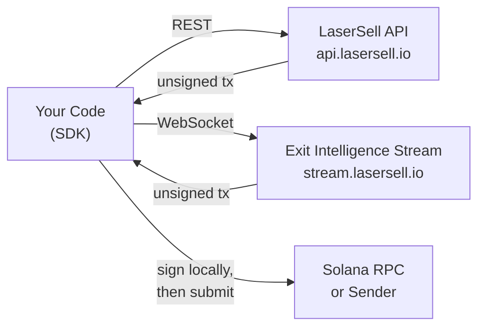

## 什么是 LaserSell API？

LaserSell API 让你能够以编程方式构建、签名和提交 Solana 兑换交易。它提供两个接口：

- **LaserSell API**（REST）：通过 `POST /v1/sell` 和 `POST /v1/buy` 按需构建未签名的买入和卖出交易。使用 `GET /v1/account` 获取账户详情，使用 `GET /v1/history` 查询交易历史。
- **退出智能流**（WebSocket）：连接一个持久会话，监控你的钱包，追踪仓位，实时评估策略，并在阈值满足时提供预构建的退出交易。

两个接口都返回**未签名交易**。你的私钥永远不会离开你的设备。你在本地签名，然后通过你选择的发送目标提交。

## 非托管模型

LaserSell 完全是非托管的。服务器构建优化的兑换指令，但没有你的签名无法执行。这意味着：

1. 你始终持有密钥对。
2. API 返回 base64 编码的未签名交易。
3. 你使用本地密钥对签名。
4. 你通过 RPC、Helius Sender 或 Astralane 提交。

LaserSell 基础设施永远不会存储或访问任何资金、代币或密钥。

## 架构概览

## SDK 语言

提供四种语言的官方 SDK，每种都提供相同的功能：

| 语言   | 包                          | 模块                                        |
|------------|----------------------------------|-------------------------------------------------|
| TypeScript | `@lasersell/lasersell-sdk`       | `ExitApiClient`, `StreamClient`, `StreamSession`, tx helpers |
| Python     | `lasersell-sdk`                  | `ExitApiClient`, `StreamClient`, `StreamSession`, tx helpers |
| Rust       | `lasersell-sdk`                  | `exit_api`, `stream`, `tx`                      |
| Go         | `github.com/lasersell/lasersell-sdk/go` | `ExitAPIClient`, `stream.StreamClient`, `stream.StreamSession`, tx helpers |

所有 SDK 共享相同的请求和响应模式、错误类型和重试行为。选择适合你技术栈的语言，按照对应的 SDK 指南操作。

## 后续阅读

- [认证](/api/authentication)：获取 API 密钥并开始发送请求。
- [快速入门](/api/quickstart)：在五分钟内构建你的第一笔卖出交易。
- [退出智能流](/api/stream/overview)：了解何时使用 WebSocket 流而不是 REST。
