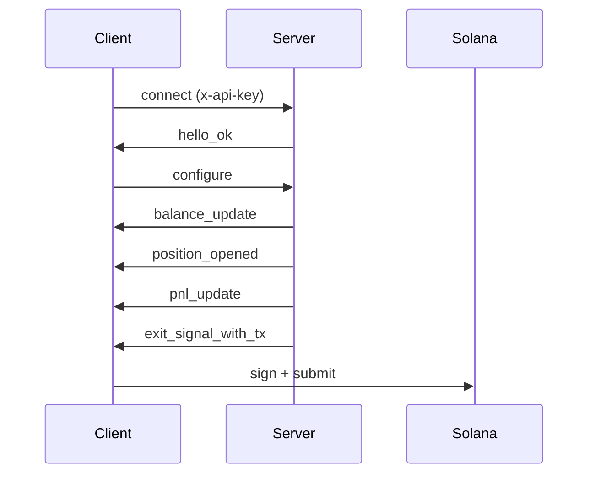

## 什么是退出智能流？

退出智能流是一个持久的 WebSocket 连接，在链上监控你的钱包、追踪代币仓位、实时评估盈亏策略，并在阈值满足时提供预构建的未签名退出交易。

**Professional 和 Advanced 等级**订阅者还会收到实时[流动性快照](/api/stream/server-events#liquidity_snapshot)，包含滑点带和流动性趋势数据，让你了解在给定价格影响下可以卖出多少仓位，以及池流动性是增长、稳定还是减少。阅读[完整公告](https://www.lasersell.io/blog/liquidity-snapshots-and-sdk-0-3)了解详情。

## 端点

```
wss://stream.lasersell.io/v1/ws
```

认证通过 `x-api-key` 头完成，SDK 自动设置。

## 何时使用退出智能流 vs REST

| 场景                                     | 使用                          |
|----------------------------------------------|------------------------------|
| 达到盈亏目标时自动卖出 | 退出智能流     |
| 单次买入或卖出交易               | REST（LaserSell API）         |
| 持续仓位监控                | 退出智能流     |
| 构建供用户确认的交易  | REST（LaserSell API）         |
| 响应钱包活动的机器人            | 退出智能流     |

当你希望服务器监控仓位并自动提供退出交易时，使用**退出智能流**。当你需要按需构建单笔交易时，使用 **REST API**。

<Warning>
**在买入之前连接流。** 退出智能流通过观察链上代币到达来检测新仓位。如果你在流连接和配置之前调用 `/v1/buy`，产生的仓位将不会被追踪且不会触发退出信号。始终先连接和配置流，然后提交买入。
</Warning>

## 高级流程

1. **连接**到 `wss://stream.lasersell.io/v1/ws`，使用你的 API 密钥。
2. 从服务器接收 `hello_ok`（包含会话 ID 和速率限制）。
3. **发送 `configure`**，包含钱包公钥和策略参数。
4. 接收现有代币持仓的初始 `balance_update` 消息。
5. **流监控**你的钱包中的新代币到达并追踪盈亏。
6. 当仓位达到你的目标利润、止损、追踪止损或截止时间时，服务器发送 `exit_signal_with_tx`。
7. **在本地签名**并提交未签名交易。



## SDK 入口点

SDK 提供两个抽象层级：

- **`StreamClient`**：底层客户端。管理 WebSocket 连接、重连和消息帧。返回原始 `ServerMessage` 对象。
- **`StreamSession`**：高级包装器。用仓位追踪、截止时间计时器、流动性快照缓存和包含 `PositionHandle` 的类型化 `StreamEvent` 对象包装 `StreamClient`。

大多数用例从 `StreamSession` 开始。

<CodeGroup>
```typescript TypeScript
import { StreamClient, StreamSession } from "@lasersell/lasersell-sdk";

const client = new StreamClient("YOUR_API_KEY");
const session = await StreamSession.connect(client, {
  wallet_pubkeys: ["WALLET_PUBKEY"],
  strategy: { target_profit_pct: 5, stop_loss_pct: 1.5 },
  deadline_timeout_sec: 45,
  send_mode: "helius_sender",
  tip_lamports: 1000,
});

while (true) {
  const event = await session.recv();
  if (event === null) break;
  // Handle event...
}
```

```python Python
from lasersell_sdk.stream.client import StreamClient, StreamConfigure
from lasersell_sdk.stream.session import StreamSession

client = StreamClient("YOUR_API_KEY")
session = await StreamSession.connect(
    client,
    StreamConfigure(
        wallet_pubkeys=["WALLET_PUBKEY"],
        strategy={"target_profit_pct": 5.0, "stop_loss_pct": 1.5},
        deadline_timeout_sec=45,
    ),
)

while True:
    event = await session.recv()
    if event is None:
        break
    # Handle event...
```

```rust Rust
use lasersell_sdk::stream::client::{StreamClient, StreamConfigure};
use lasersell_sdk::stream::session::StreamSession;
use lasersell_sdk::stream::proto::StrategyConfigMsg;
use secrecy::SecretString;

let client = StreamClient::new(SecretString::new(std::env::var("LASERSELL_API_KEY")?));
let session = StreamSession::connect(&client, StreamConfigure {
    wallet_pubkeys: vec!["WALLET_PUBKEY".into()],
    strategy: StrategyConfigMsg {
        target_profit_pct: 5.0,
        stop_loss_pct: 1.5,
        ..Default::default()
    },
    deadline_timeout_sec: Some(45),
}).await?;

loop {
    let event = match session.recv().await {
        Some(event) => event,
        None => break,
    };
    // Handle event...
}
```

```go Go
import "github.com/lasersell/lasersell-sdk/go/stream"

client := stream.NewStreamClient("YOUR_API_KEY")
session, err := stream.ConnectSession(ctx, client, stream.StreamConfigure{
    WalletPubkeys: []string{"WALLET_PUBKEY"},
    Strategy: stream.StrategyConfigMsg{
        TargetProfitPct: 5.0,
        StopLossPct:     1.5,
    },
    DeadlineTimeoutSec: 45,
})
if err != nil {
    log.Fatal(err)
}

for {
    event, err := session.Recv(ctx)
    if errors.Is(err, io.EOF) {
        break
    }
    // Handle event...
}
```
</CodeGroup>

## 后续步骤

- [连接生命周期](/api/stream/connection-lifecycle)：详细的握手、重连和通道分离。
- [策略配置](/api/stream/strategy-configuration)：配置利润目标、止损和追踪止损。
- [服务器事件](/api/stream/server-events)：所有 9 种服务器消息类型的完整模式，包括流动性快照。
- [客户端消息](/api/stream/client-messages)：所有 6 种客户端消息类型及其模式。
