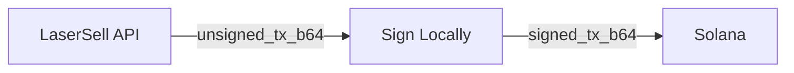

## 非托管流程

LaserSell 永远不会接触你的私钥。每笔交易遵循此模式：

1. **构建**：API 返回 base64 编码的未签名 `VersionedTransaction`。
2. **签名**：你在本地使用密钥对解码、签名和重新编码。
3. **提交**：你通过[发送目标](/api/transactions/send-targets)将已签名交易发送到 Solana 网络。

关于每种语言的密钥对加载、签名函数、快速签名、签名并发送以及错误类型的完整代码示例，请参阅[英文版](/api/transactions/signing)。所有 SDK 方法名和签名与英文版完全一致。

## 安全最佳实践

- **永远不要记录或传输**你的私钥。
- 生产环境中**从环境变量**或加密文件加载密钥。
- **验证钱包地址**与构建请求中使用的 `user_pubkey` 匹配。API 为该特定签名者构建交易。
